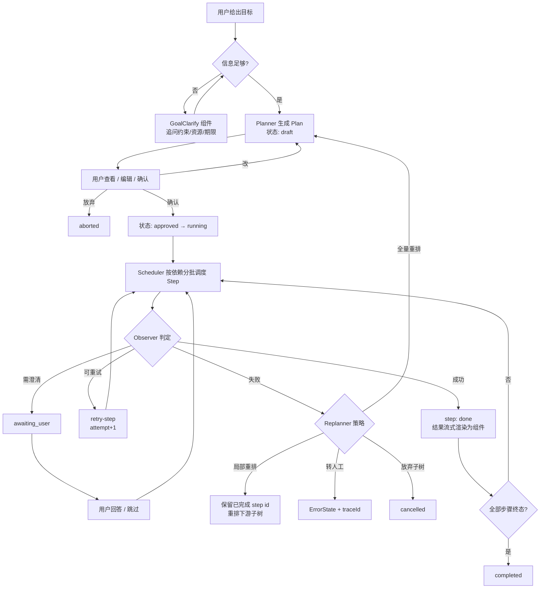

# planning-agent · 基座产品需求文档（PRD）

| 项 | 内容 |
|---|---|
| 文档版本 | v1.0（2026-10-02） |
| 范围 | **仅基座（内核）**。不含任何具体领域的实现 |
| 读者 | 架构实现、前端实现（vibe coding） |
| 配套文档 | `README.md`（分层与目录）、`CONSTRAINTS.md`（vibe coding 约束） |

---

## 1. 定位与范围界定

### 一句话

**一个目标驱动的规划型 Agent 基座**：用户给目标，Agent 产出可见可编辑的计划，逐步执行并动态重规划；领域通过 Domain Pack 接入，内核零改动。

### 明确不做（Out of Scope）

| 不做 | 原因 |
|---|---|
| 任何具体领域的业务逻辑 | 属于 Domain Pack，不在基座 |
| 具体的事实数据源接入 | 由领域 Provider 负责，基座只定义 `ProviderAdapter` 形状 |
| 账号体系 / 付费 / 权限 | 匿名即可跑通，MVP 不做 |
| 多端（RN / 小程序） | Web 优先；`shared/` 契约跨端可复用，渲染层后议 |
| 长期运行的后台任务 | 单次请求内跑完（<25s） |

---

## 2. 产品目标（可衡量）

| # | 目标 | 指标 |
|---|---|---|
| G1 | **计划一次成型**：目标澄清后，首版计划无需重规划即可执行到底 | 一次成型率 ≥70% |
| G2 | **重规划收敛**：遇到问题能自己修好，不原地打转 | 平均重规划 ≤2 轮；触发"强制转人工"比例 ≤10% |
| G3 | **可扩展**：新增一个领域足够轻，且不需要改内核任何一个文件 | 新增一个轻量 Domain Pack ≤800 行 / ≤1 人日；**内核文件改动数 = 0** |

> ★ G3 是本项目的核心主张。**它不能用口头声称，只能用 `git diff` 证明**（见 §10）。

---

## 3. 术语

| 术语 | 定义 |
|---|---|
| Goal | 用户给的目标，含约束、资源边界与成功判据 |
| Plan | 一等公民数据对象：可序列化、可 diff、可编辑、可局部推翻重建 |
| Step | 计划最小单元，带依赖 DAG 与状态机 |
| Revision | 计划版本号，每次重规划 +1，历史可回溯 |
| DomainPack | 一个领域必须提供的全部能力的集合 |
| RuntimeAdapter | 内核唯一可见的执行接口 |
| Replan | 因失败/新信息/用户编辑而重新生成计划的局部或全部 |

---

## 4. 用户故事（基座视角）

| ID | 作为… | 我希望… | 以便… |
|---|---|---|---|
| US-1 | 用户 | 只说一个目标（而非拆好的指令），Agent 能自己拆成步骤 | 我不用先想清楚怎么做 |
| US-2 | 用户 | 看到**完整计划**再决定要不要执行 | 我不把控制权交给黑盒 |
| US-3 | 用户 | 改其中一步（改内容/删掉/换顺序/加约束）后继续执行 | 计划能贴合我的实际情况 |
| US-4 | 用户 | 执行中随时中断、跳过某步、重试某步 | 出错时我不必从头再来 |
| US-5 | 用户 | 某步失败后，Agent 只重排**受影响的部分**，已完成的保留 | 不浪费已完成的劳动 |
| US-6 | 用户 | 每一步在干什么、花了多久、数据来自哪里都看得见 | 出问题时我能判断该不该信 |

---

## 5. 核心旅程



**每一步都必须有失败兜底**：计划生成失败 → `ErrorState`；步骤校验失败 → 降级组件；Provider 校验不通过 → `Replanner`；重规划不收敛 → 强制转人工。**任何情况下都不白屏。**

---

## 6. ★ 计划的交互契约

这类产品最容易做砸的地方，写死如下。

### 6.1 计划如何展示

| 元素 | 形态 | 说明 |
|---|---|---|
| 计划总览 | `PlanView` 组件（**内核通用组件**） | 步骤列表 + 整体进度 + 预估总成本/时长 |
| 单个步骤 | `StepItem`（内核通用组件） | 标题、状态徽标、耗时、依赖关系缩进 |
| 步骤结果 | **由领域决定** | 内核只持 `emittedNodeIds`，在自己的 slot 里渲染，**不解析其 props** |
| 流式新增步骤 | JSON Patch `/items/-` 追加 | 卡片逐条长出，不整包重发 |

### 6.2 用户能做什么

| 操作 | 语义 | 内核行为 |
|---|---|---|
| 改某一步内容 | `editStep` | 记录 `origin: {kind:'user', editedFields}`，**自动锁定该步** |
| 删除某步 | `removeStep` | 级联：下游依赖失效 → 转 `pending` |
| 新增一步 | `addStep` | 可指定 `dependsOn` |
| 调整顺序 / 依赖 | `reorder` | 重算拓扑批次 |
| 改整体约束 | `editGoal` | 触发评估：影响面小则 L1，大则 L2 |
| 中断 | `abort` | 计划转 `paused`，可恢复 |
| 重试单步 | `retryStep` | `attempt+1`，`idempotencyKey` 变化 |
| 跳过单步 | `skipStep` | 转 `skipped`，下游重新评估 |

### 6.3 编辑后的回写（三档）

| 档 | 触发 | 行为 | 成本 |
|---|---|---|---|
| **L0 纯 pending 微调** | 只改尚未执行的步骤文本 | 本地直接改，**零延迟零成本** | 0 |
| **L1 增量重规划** | 影响下游 | 从**最早受影响的未完成步**开始重排，**保留已完成 stepId** | 低 |
| **L2 全量重规划** | 改了目标级约束 | 重新生成 Plan，`revision+1` | 高 |

> ★ **已完成步骤默认冻结**：改动已完成的步骤需要显式 `rollback_to_step`，否则不允许。

### 6.4 状态实时呈现

Step 状态机：`pending → ready → running → done / failed / awaiting_user`，另有 `skipped`、`cancelled`。
Plan 状态机：`draft → approved → running → paused / replanning → completed / failed / aborted`。

---

## 7. ★ Domain Pack 契约（扩展点）

一个领域必须提供以下 **8 段**。这是"可扩展"的命根子。

```ts
export interface DomainPack {
  meta: DomainMeta;                          // ① 领域元数据与路由匹配
  tools: ToolSet;                            // ② 工具集
  providers: DomainProviders;                // ③ 事实数据源（反幻觉强制点）
  ui: DomainUIContribution;                  // ④ 生成式 UI 组件集
  prompts: DomainPrompts;                    // ⑤ 提示词片段
  planning: DomainPlanningContribution;      // ⑥ 步骤类型与计划模板
  evaluation: DomainEvaluationContribution;  // ⑦ 评测钩子
  lifecycle?: DomainLifecycle;               // ⑧ 生命周期（可选）
}
```

### ① meta

```ts
export interface DomainMeta {
  id: string;                    // /^[a-z][a-z0-9-]{1,31}$/
  displayName: string;
  version: string;               // semver
  schemaVersion: 1;
  description: string;           // 给路由模型看的一句话
  matcher: DomainMatcher;        // keywords / patterns / negativeKeywords / scoreBySignals
  requiredSignals?: InputSignalKind[];  // 'image' | 'text' | 'geo' | 'link' | 'file'
  capabilities: {
    vision: boolean;        // 支持图片理解
    geo: boolean;           // 涉及地理位置
    providers: boolean;     // ★ false 时禁止模型产出事实，只能给观点
    timeSequence: boolean;  // 计划是否天然按时序
  };
}
```

### ② tools

```ts
export interface ToolSpec {
  name: string;
  description: string;           // ★ 给模型看的中文说明
  inputSchema: z.ZodTypeAny;     // zod 4：同时产出 TS 类型与 JSON Schema
  producesFacts: boolean;        // ★ true = 产出被视为事实，模型不得编造
  idempotent: boolean;           // 可用 idempotencyKey 安全重试
  timeoutMs: number;
  retryable: boolean;
  stepType?: string;             // 供 Planner 反推 step.type
}
```

### ③ providers（反幻觉强制点）

```ts
export interface DomainProviders {
  namespace: string;             // 用于 SourceRef 溯源
  create(ctx: ProviderContext): Record<string, ProviderAdapter<any, any>>;
  /** 可选：校验型 Provider —— 见 §7.1 */
  createValidator?(ctx: ProviderContext): ValidatingProvider | undefined;
}

export interface ProviderAdapter<Q, R> {
  id: string;
  search(query: Q, ctx: RunContext): Promise<ProviderResult<R[]>>;
  detail?(id: string, ctx: RunContext): Promise<ProviderResult<R | null>>;
}

export interface ProviderResult<T> {
  ok: boolean;
  data?: T;
  source: SourceRef;             // ★ 每条事实必须带来源
  isEstimate?: boolean;          // mock/估算必须标记，UI 必须显示免责声明
  disclaimer?: string;
  error?: AgentError;
  durationMs: number;
}
```

### 7.1 ★ 内核不认识领域语义（校验型 Provider）

这是"内核通用"最锋利的证据，也是最容易写歪的地方。

```ts
export interface ValidatingProvider {
  validate(plan: Plan, ctx: RunContext): Promise<ValidationResult>;
}

export interface ValidationResult {
  ok: boolean;
  violations: Array<{
    severity: 'error' | 'warning';   // ✅ 内核唯一可读
    code?: unknown;                  // ⛔ 内核不可读，不透传解析
    message?: unknown;               // ⛔ 内核不可读
    suggestion?: unknown;            // ⛔ 内核不可读
    evidence?: unknown;              // ⛔ 内核不可读
  }>;
}
```

**内核侧唯一正确的消费方式**：

```ts
// ✅ 正确：只认布尔与 severity，触发码用内核通用码
if (!res.ok) {
  triggerReplan({ reason: 'PROVIDER_VALIDATION_FAILED', severity: 'error' });
}

// ❌ 错误：内核知道了领域语义
if (violations[0].code === 'BUDGET_OVERRUN') { /* ... */ }
```

**判定手段**：扫描 `core/**` 对 `.code` / `.evidence` / `.suggestion` / `.message` 的读取，命中数必须为 0。

### ④ ui

```ts
export interface DomainUIContribution {
  components: ComponentDefinition[];
  degradeChain: {
    rawPayload: string;   // schema 校验失败 → 展示原始载荷
    clarify: string;      // 置信度不足 → 让用户点选
    error: string;        // 彻底失败 → 错误态 + traceId
    skeleton: string;     // 等待首个组件 → 骨架
  };
  stepRenderers: Record<string, {
    component: string;
    toProps: (result: unknown, step: Step, ctx: RunContext) => Record<string, unknown>;
  }>;
}
```

### ⑤⑥⑦⑧ prompts / planning / evaluation / lifecycle

- `prompts`：领域世界观 + 约束，**必须含 `antiHallucination` 硬插槽**（内核强制注入）
- `planning`：`stepTypes` 白名单 + 计划模板 + `validateStep`
- `evaluation`：评测钩子（供 benchmark 与回归）
- `lifecycle`：可选的初始化 / 销毁

---

## 8. ★ Plan / Step 数据结构

### 8.1 Step

```ts
export type StepStatus =
  | 'pending' | 'ready' | 'running' | 'done'
  | 'failed' | 'skipped' | 'cancelled' | 'awaiting_user';

export interface Step {
  id: string;                     // ★ 稳定 id；replan 保留已完成 → 天然幂等键
  domainId: string;
  type: string;                   // 必须命中 DomainPack.planning.stepTypes
  order: number;

  title: string;
  description?: string;
  estimate?: StepCostEstimate;

  dependsOn: string[];            // DAG
  parallelGroup?: string;         // 同组可并行

  status: StepStatus;
  intent: StepIntent | null;      // null = 纯推理步骤
  idempotencyKey: string;         // `${runId}:${step.id}:${attempt}`
  attempt: number;
  maxAttempts: number;            // 默认 2

  origin: StepOrigin;             // ★ 编辑溯源
  result?: StepResult;
  error?: AgentError;
  emittedNodeIds: string[];       // 产出到 UI 的组件节点
  renderAs?: string;

  createdAt: string;
  updatedAt: string;
}

export type StepOrigin =
  | { kind: 'planner'; revision: number }
  | { kind: 'replan'; revision: number; parentStepId?: string; reason: string }
  | { kind: 'user'; revision: number; editedFromStepId: string; editedFields: string[]; editedAt: string };

export interface StepResult {
  ok: boolean;
  data?: unknown;
  sourceRefs: SourceRef[];        // ★ 事实溯源，来自 Provider 才允许填
  isEstimate?: boolean;
  durationMs: number;
}
```

### 8.2 Plan

```ts
export type PlanStatus =
  | 'draft' | 'approved' | 'running' | 'paused'
  | 'replanning' | 'completed' | 'failed' | 'aborted';

export interface Plan {
  id: string;
  runId: string;
  goalId: string;
  domainId: string;
  revision: number;               // 每次重规划 +1
  status: PlanStatus;
  steps: Step[];
  createdAt: string;
  updatedAt: string;
}
```

---

## 9. 动态重规划

### 9.1 触发原因 → 策略

| 触发 | 策略 |
|---|---|
| 单步超时 / 可重试错误 | `retry-step` |
| 单步不可重试失败 | `local-subtree`（重排下游） |
| 新信息推翻前提 | `local-subtree` 或 `full-replan`（按影响面） |
| 置信度不足 / 多候选 | `ask-user`（`ClarifyOptions`） |
| 用户编辑了未完成步骤 | L0 / L1（见 §6.3） |
| 用户改了目标级约束 | `full-replan` |
| 环境问题（网络/限流） | `retry-step`，不重排 |

### 9.2 保留已完成步骤（核心）

局部重规划 = **反向收集下游受影响子树**；**已完成 step id 不变** → 天然幂等键，已渲染的结果节点不会失效。

### 9.3 避免无限循环（三重闸门）

| 闸门 | 上限 |
|---|---|
| 重规划次数 | ≤ 5 |
| 单轮成本 | ≤ ¥2 |
| 单轮时长 | ≤ 25s |

**收敛判定**：新计划与旧计划的 **delta < 0.15 判定为原地打转，强制转人工**。

---

## 10. 需求池

### P0（M1–M3 闭环）

| ID | 需求 | 验收 |
|---|---|---|
| C0-01 | Goal 解析与澄清 | 信息不足时走 `GoalClarify`，不直接硬猜 |
| C0-02 | Planner 生成 Plan | 输出结构化 Plan，步骤类型命中白名单 |
| C0-03 | Plan/Step 状态机 | 8 种 step 状态、8 种 plan 状态全部可达 |
| C0-04 | Executor + Scheduler | 按依赖拓扑分批；同 `parallelGroup` 并行 |
| C0-05 | Observer | 判定成功/可重试/需澄清，产出 Observation |
| C0-06 | Replanner | 策略表 + 三重闸门 + 收敛判定 |
| C0-07 | ★ 局部重规划保留已完成步骤 | 已完成 stepId 不变 |
| C0-08 | 用户编辑三档回写 L0/L1/L2 | 已完成步骤默认冻结 |
| C0-09 | PlanCompiler（纯函数 + 环检测） | 单测覆盖；有环时报错而非死循环 |
| C0-10 | RuntimeAdapter + MockRuntime | 内核只依赖接口 |
| C0-11 | DomainPack 注册表 + 完整性守卫 | 缺段则注册失败 |
| C0-12 | 三级降级（内核通用） | `RawPayloadCard → ClarifyOptions → ErrorState`，绝不白屏 |
| C0-13 | zod 运行时校验 | 所有模型/网络输入 `safeParse` |
| C0-14 | 计划可见的流式渲染 | `/items/-` 追加，逐条长出 |
| C0-15 | 中断与恢复 | `abort` → `paused` → 可恢复 |

### P1

| ID | 需求 |
|---|---|
| C1-01 | MastraRuntime（第二个 RuntimeAdapter 实现） |
| C1-02 | 计划版本历史与 diff 视图 |
| C1-03 | 埋点：`first_component_ms` / `component_degraded` / `cost_per_turn` |
| C1-04 | Evals 流水线（供领域 benchmark） |
| C1-05 | 计划模板库（跨领域复用） |

### P2

| ID | 需求 |
|---|---|
| C2-01 | 领域路由（多域自动选择） |
| C2-02 | 长任务异步化（脱离 25s 限制） |
| C2-03 | 多端渲染层复用 |

---

## 11. 非功能需求

| 项 | 指标 |
|---|---|
| 计划生成延迟 | P50 ≤3s / P95 ≤6s |
| 单步状态可见延迟 | ≤300ms |
| 中断响应 | ≤500ms |
| 单轮总时长 | ≤25s（Serverless 硬约束） |
| 组件校验失败率 | <3%（超过说明 prompt 或 schema 有问题） |
| 可扩展性 | 新增领域 ≤800 行 / ≤1 人日 / **内核改动 0** |

---

## 12. 验收标准

### 12.1 功能验收

- P0 全部通过
- 任意时刻中断，界面不白屏、不卡死
- 单步失败后重排，已完成步骤不重跑

### 12.2 ★ 可扩展性验收（核心）

```bash
git tag m1-core-only
# 接入第一个领域后
git diff --numstat m1-core-only..HEAD -- src/core/** src/shared/** | wc -l   # → 0
# 接入第二个（约束形状不同的）领域后，再跑一次，仍必须为 0
rm -rf src/domains/<second> && npm run build    # 反向剥离验证
```

**"可扩展"这个主张唯一的硬证据是 `git diff`，不是口头声称。** 改一行注释也不算通过。

---

## 13. 待确认

| # | 问题 | 当前倾向 |
|---|---|---|
| Q1 | 第一个接入哪个领域做验证 | 任选，但第二个必须与第一个**约束形状正交** |
| Q2 | 领域路由是规则优先还是模型优先 | 规则优先（便宜），模型兜底 |
| Q3 | `paused` 状态的持久化放哪 | MVP 内存 + 短期 TTL，不做长期持久化 |
| Q4 | 是否需要计划的协同/分享 | 不做 |
