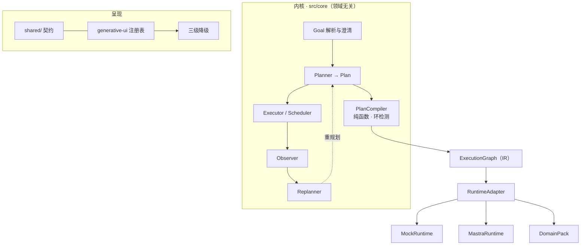

# planning-agent · 架构地图（给 AI 读的精简版）

> **本文只有地图与指针，不含选型论证。**
> 论证在 `docs/CONSTRAINTS.md`（规则与理由）和 `docs/PRD.md`（需求与验收）；深入版见 `techDocs/01-架构设计.md`。
> **契约的唯一真源是代码里的 zod schema**，不是本文档；本文只告诉你去读哪个文件。

---

## 1. 分层



**内核不认识任何领域语义。** 它不知道自己在排行程、排工序还是排知识点。

---

## 2. 目录与职责

```
planning-agent/
├── app/
│   ├── page.tsx                      # 'use client' 壳，不含业务
│   ├── layout.tsx / globals.css
│   └── api/
│       ├── run/route.ts              # 创建 run；SSE 流式下发 Plan/Step/组件
│       └── [...mastra]/route.ts      # @mastra/next 适配器（仅 MastraRuntime 用）
├── src/
│   ├── core/
│   │   ├── goal/
│   │   │   ├── parse.ts              # 目标 → Goal（含约束/资源/期限）
│   │   │   └── clarify.ts            # 信息不足 → 生成澄清问题
│   │   ├── planning/
│   │   │   ├── planner.ts            # Goal → Plan（调模型，输出结构化）
│   │   │   ├── types.ts              # Plan / Step / Goal 的 zod schema ★真源
│   │   │   ├── validate.ts           # 步骤合法性校验（委托给领域 validateStep）
│   │   │   └── edit.ts               # 用户编辑三档回写 L0/L1/L2
│   │   ├── execution/
│   │   │   ├── scheduler.ts          # 拓扑分批 + parallelGroup 并行
│   │   │   ├── executor.ts           # 执行单步（经 RuntimeAdapter）
│   │   │   └── observer.ts           # 判定 成功/可重试/需澄清/失败
│   │   ├── replan/
│   │   │   ├── policy.ts             # 触发原因 → 策略决策表
│   │   │   ├── impact.ts             # 反向收集下游受影响子树
│   │   │   └── gates.ts              # 三重闸门 + 收敛判定
│   │   ├── compiler/
│   │   │   ├── planCompiler.ts       # ★ 纯函数：Plan → ExecutionGraph(IR)
│   │   │   └── cycleDetect.ts        # 依赖环检测
│   │   ├── degrade/
│   │   │   └── policy.ts             # 三级降级（领域无关）
│   │   ├── registry/
│   │   │   └── domainRegistry.ts     # DomainPack 注册 + 完整性守卫
│   │   └── runtime/
│   │       ├── adapter.ts            # ★ RuntimeAdapter 接口（内核唯一可见）
│   │       ├── mock/                 # MockRuntime（先行实现）
│   │       └── mastra/              # MastraRuntime（后接；唯一可 import @mastra/* 处）
│   ├── domains/
│   │   ├── index.ts                  # ★ 服务端桶：registerAllDomains()（route.ts 唯一引用点）
│   │   ├── ui.ts                     # ★ 客户端桶：registerAllUI()（page.tsx 唯一引用点）
│   │   └── demo/                     # 验证装置领域包（register.ts 服务端注册 / register-ui.ts 前端注册）
│   ├── components/generative-ui/
│   │   ├── registry.ts               # 组件注册表
│   │   ├── ComponentRenderer.tsx     # zod 校验 → 降级 → 查表 → lazy 加载
│   │   ├── PlanView/ StepItem/       # 内核通用组件
│   │   └── RawPayloadCard/ ClarifyOptions/ ErrorState/ SkeletonList/   # 通用兜底
│   ├── features/run/
│   │   ├── useRun.ts                 # useChat 封装
│   │   ├── nodeReducer.ts            # 组件 props 的 JSON Patch 累积
│   │   └── useCoalescedNodes.ts      # 16ms 合批，避免高频重渲染
│   └── lib/
└── shared/
    ├── plan/types.ts                 # ★ Plan/Step/Goal 的 zod schema（唯一真源）
    ├── stream/events.ts              # ★ 流式事件（AI SDK data part）schema
    └── domain/types.ts               # ★ DomainPack 契约的 zod schema
```

---

## 3. 契约在哪（改类型先改这些文件）

| 想知道 | 读哪个文件 |
|---|---|
| Plan / Step / Goal 长什么样 | `shared/plan/types.ts` |
| 流式事件有哪些 | `shared/stream/events.ts` |
| 领域包要提供什么 | `shared/domain/types.ts` |
| 组件 props 怎么校验 | 各组件目录下的 `schema.ts` |
| 执行接口长什么样 | `src/core/runtime/adapter.ts` |
| 一次 run 的请求体（含续跑/编辑） | `shared/run/types.ts` |
| 重排怎么判"没进展" | `src/core/replan/gates.ts` · `subtreeDelta`（比较域 = **受影响子树**） |

**禁止在别处重新定义这些类型。** 需要新字段就在对应的 `shared/` schema 里加。

---

## 4. 一次轮次的数据流

```
1. 用户给目标
   → POST /api/run
2. goal/parse + clarify
   → 信息不足则下发 GoalClarify 组件，等用户补
3. planner 生成 Plan（status = draft）
   → 流式下发 plan_start + 逐条 step（/items/- 追加）
4. 用户在 UI 上查看 / 编辑 / 确认
   → edit.ts 判定 L0 / L1 / L2
5. approved → running，scheduler 按拓扑分批
6. executor 经 RuntimeAdapter 执行单步
   → 工具调用委托给 DomainPack.tools
   → 事实数据来自 DomainPack.providers（必带 SourceRef）
7. observer 判定
   → done：结果经 stepRenderers 映射为组件，流式下发
   → 可重试：attempt+1
   → 需澄清：下发 ClarifyOptions，step 转 awaiting_user
   → 失败：进 replan/policy
8. replanner 选策略（retry-step / local-subtree / full-replan / ask-user）
   → 局部重排保留已完成 stepId
   → 领域 validator 返回 ok:false 也在这里触发（内核只认 ok/severity）
9. 全部终态 → completed

※ 3.5 validatePlan（逐步骤 + 校验型 Provider）在「计划生成后」与「每次重排后」各跑一次；
   结果只取 ok 与最高 severity，处置策略集中在 replan/policy.ts::decideValidationAction。
※ 终态（paused / failed / awaiting_user）可带 plan 快照 + edit 命令重发，走「先编辑、再重跑」。
```

---

## 5. 状态机

**Step**：`pending → ready → running → done | failed | awaiting_user`，另有 `skipped`、`cancelled`
**Plan**：`draft → approved → running → paused | replanning → completed | failed | aborted`

已完成步骤**默认冻结**，改动需显式 `rollback_to_step`。

---

## 6. 扩展点：新增一个领域

只需新增 `src/domains/<id>/`，实现 `DomainPack` 8 段：

| 段 | 提供什么 |
|---|---|
| `meta` | 领域标识、路由匹配、能力开关（vision/geo/providers/timeSequence） |
| `tools` | 工具集；`producesFacts=true` 的必须返回 `SourceRef` |
| `providers` | 事实数据源；可选 `createValidator` 做约束校验 |
| `ui` | 组件集 + 降级链（**服务端概念**，前端恒用 `CORE_DEGRADE_CHAIN`）+ `stepRenderers` 映射 |
| `prompts` | 提示词片段，**必须含 antiHallucination 插槽** |
| `planning` | `stepTypes` 白名单 + 模板 + `validateStep` |
| `evaluation` | 评测钩子 |
| `lifecycle` | 可选初始化/销毁 |

完整字段定义见 `docs/PRD.md` §7；分步模板见 `docs/CONSTRAINTS.md` §5.2。

---

## 7. 边界纪律（可执行判据）

```bash
grep -rnE "<领域词>" src/core shared | wc -l             # 必须 0
grep -rn "\.code\|\.evidence\|\.suggestion" src/core | wc -l  # 必须 0
grep -rn "@mastra/" src --include=*.ts | grep -v "core/runtime/mastra" | wc -l  # 必须 0
rm -rf src/domains/<x> && npm run build                       # 必须通过
git diff --numstat <core-tag>..HEAD -- src/core/** shared/** | wc -l        # 必须 0
```

最后一条是"可扩展"这个主张**唯一的硬证据**。

### 反向剥离的真实成本（当前实测）

生产代码里对领域包的引用共 **2 个文件 / 2 处 import**：

| 文件 | import | 说明 |
|---|---|---|
| `app/api/run/route.ts` | `import { registerAllDomains } from '@/src/domains'` | 服务端唯一引用点 |
| `app/page.tsx` | `import { defaultDomainId, registerAllUI } from '@/src/domains/ui'` | 客户端唯一引用点 |

另有 3 个测试文件各 1 处 `registerAllDomains`（`src/test/closedLoop.test.ts`、`src/test/edgeCases.test.ts`、`src/test/validation.test.ts`）—— 测试必须引用一个领域包才跑得起闭环，不计入生产引用点。

两个桶文件刻意分开：`ui.ts` 会触及 `'use client'` 的 React 组件，一旦被服务端间接 import，就会把组件代码拖进服务端模块图。
