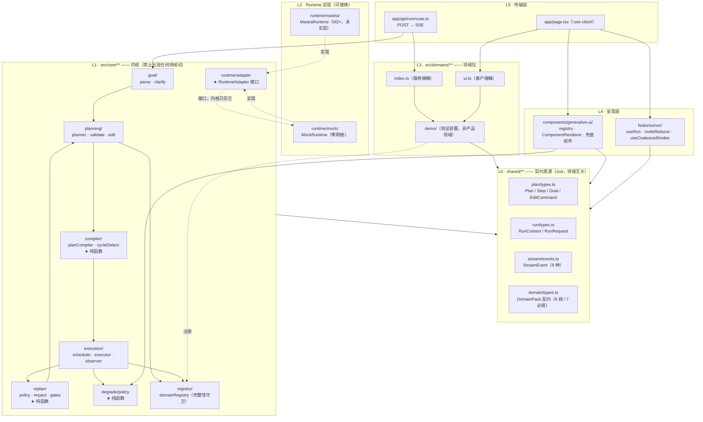
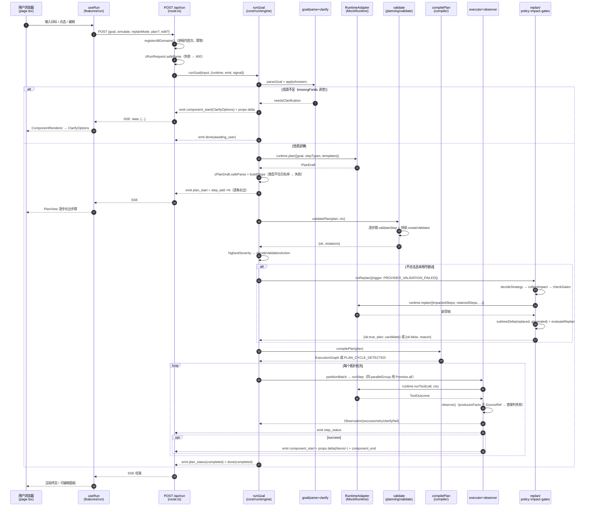
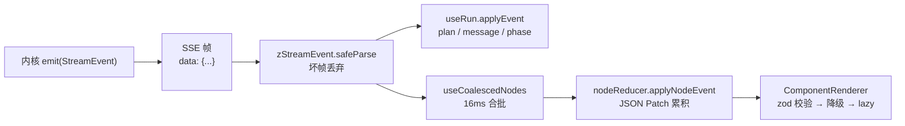
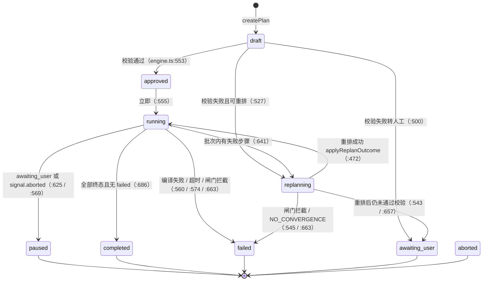
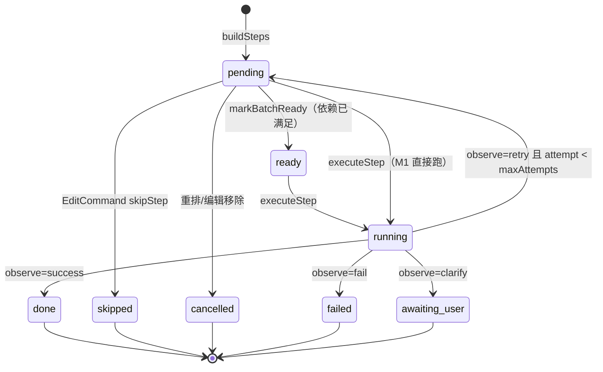

# 01 · 架构设计（深入版）

> **对应 commit**：`dc9248c`（tag `m1-core-only`）
> **本文定位**：给**人**读的架构论证文档。写的是"为什么这么设计"和"放弃了什么"，不是地图。
> 地图看 `docs/ARCHITECTURE.md`，规则看 `docs/CONSTRAINTS.md`，需求看 `docs/PRD.md`。
> **契约的唯一真源是代码里的 zod schema**，不是本文。本文引用的每一处行号都对应 `dc9248c`。

**代码规模**（`src/` + `shared/` + `app/`，ts/tsx）：**74 个文件 / 8222 行**。

| 目录 | 文件数 | 行数 | 性质 |
|---|---:|---:|---|
| `src/core/**` | 28 | 4350 | 领域无关内核（含 8 个测试文件） |
| `shared/**` | 4 | 855 | 前后端唯一契约真源 |
| `src/domains/**` | 16 | 717 | 领域包（含 `demo/` 验证装置） |
| `src/components/**` | 15 | 569 | 通用生成式 UI 注册表 + 兜底组件 |
| `src/features/**` | 4 | 562 | 前端 run 状态机与流式累积 |
| `src/test/**` | 4 | 744 | 端到端闭环 / 边界用例 |
| `app/**` | 3 | 425 | 传输层唯一入口 |

---

## 1. 定位与边界：是什么 / 不是什么

一句话：**一个目标驱动的规划型 Agent 基座**——用户给目标，Agent 产出**可见可编辑的计划**，逐步执行并**动态重规划**；领域通过 Domain Pack 接入，内核零改动。

| 是 | 不是 | 为什么划这条线 |
|---|---|---|
| 规划型 Agent 的**内核**（goal / planning / execution / replan / compiler） | 某一种 Agent 应用（行程规划、排产、学习规划） | 应用逻辑属于 Domain Pack。内核出现第 1 个领域词，可扩展性主张就死了 |
| **Plan 是一等公民数据对象**（可序列化 / diff / 编辑 / 局部推翻） | 模型上下文里的隐式计划（ReAct 式"边想边调工具"） | 见 §2。隐式计划无法被校验、无法被局部推翻、无法被用户改 |
| **RuntimeAdapter 接口**的消费者 | 某个框架（Mastra / LangGraph）的封装层 | 内核只依赖 3 个方法（`plan` / `replan` / `runTool`），换实现不改内核 |
| **契约定义者**（zod schema + 槽位名） | 领域语义的解释者 | 内核只认 `ok` 与 `severity` 两个信号，不读 violation 的 `code/message/suggestion/evidence` |
| 单次请求内跑完的**短任务编排**（<25s） | 长期后台任务 / 工作流引擎 | 单轮有硬闸门（次数 ≤5 / 成本 ≤¥2 **元** / 时长 ≤25s），越界的必须转人工 |
| Web 优先（Next.js App Router） | 多端框架 | `shared/**` 的契约可跨端复用，渲染层后议 |
| 匿名可跑通的基座 | 带账号 / 付费 / 权限的产品 | MVP 不做，不挤占内核预算 |

### 1.1 与「直接让 LLM 循环调工具」的分界线

| 能力 | 隐式循环（ReAct / tool loop） | 本基座（显式计划） |
|---|---|---|
| 计划可见 | 只在模型上下文里 | `Plan` 是可下发、可渲染的数据对象 |
| 用户可改 | 只能在下一轮 prompt 里"求它改" | `EditCommand` 8 种命令，三档回写（L0/L1/L2） |
| 局部推翻 | 做不到——上下文是整体的 | `collectImpact` 反向收集受影响子树，**已完成 step 天然不进影响面** |
| 执行前校验 | 做不到——边跑边想 | `validatePlan` 在跑之前拦下，不合法一步都不执行 |
| 幂等 / 不重复付费 | 靠模型"记得"自己做过什么 | `makeIdempotencyKey(runId, stepId, attempt)` + 已完成步骤冻结 |
| 中断续跑 | 上下文丢了就得从头 | Plan 快照跨请求回传（不可信 → 重新校验 → 归一状态） |
| 兜底 | 模型自己决定 | 三重闸门 + 收敛判定 + 三级降级，全部是**内核纯函数**，模型无法绕过 |

---

## 2. 问题定义：为什么需要"计划文档"这一层

这是整个项目最根本的取舍。把计划从"模型的思考过程"提升为**内核持有的一等数据对象**，是为了同时拿到 7 样东西，而它们彼此是耦合的——缺了计划这一层，一样都拿不到。

| # | 要解决的问题 | 计划这一层提供的机制 | 代码落点 |
|---|---|---|---|
| 1 | **可干预**：用户要能改，而不是求模型改 | `EditCommand` discriminated union（8 种），`classifyEdit` 判定 L0/L1/L2 三档 | `shared/plan/types.ts:263-287`、`src/core/planning/edit.ts:54-111` |
| 2 | **可局部推翻**：一步失败不该推翻整份计划 | `collectImpact` 反向收集依赖该步的**下游子树**，已完成步骤被剔除 | `src/core/replan/impact.ts:27-85` |
| 3 | **幂等**：重排后不能重复执行已产生副作用/已付成本的步骤 | 已完成 step 的 `id` 在重排后不变 → `idempotencyKey` 天然稳定 | `shared/plan/types.ts:155`、`src/core/planning/planner.ts:183-222` |
| 4 | **执行前校验**：把"跑完才发现错"提前到"跑之前拦下" | `validatePlan` = 逐步骤 + 领域校验型 Provider，在 `approved` 之前跑 | `src/core/planning/validate.ts:33-52`、`engine.ts:505` |
| 5 | **可计数的"轮次"**：成本/次数/时长闸门需要一个计量单位 | `ReplanBudget { replanCount, costCNY, startedAtMs }` 挂载在 run 上，`revision` 每次重排 +1 | `src/core/replan/gates.ts:26-31` |
| 6 | **可中断续跑**：HTTP 断开、转人工后要能接着跑 | Plan 可序列化 → 客户端回传快照（不可信 → `zPlan.safeParse` → 归一） | `engine.ts:101-147` |
| 7 | **流式呈现**：计划要"逐条长出"而不是等全跑完 | `step_add` 事件一条一条下发，前端 append | `engine.ts:302-305`、`useRun.ts:108-117` |

### 2.1 代价（诚实列出）

| 代价 | 说明 |
|---|---|
| 多一次模型调用 | 先规划再执行，比"边想边做"多一轮 `runtime.plan()` |
| 计划与执行的一致性要自己维护 | 计划被编译成 `ExecutionGraph` 后才能调度；重排后必须**重新编译**（`engine.ts:667-671`） |
| 依赖图是数据就得自己防环 | 引入 `cycleDetect` + `PLAN_CYCLE_DETECTED` + `PLAN_DEPENDENCY_MISSING` + `PLAN_PARALLEL_GROUP_DEPENDENCY` 三条编译期错误 |
| 状态机变复杂 | Plan 8 态 / Step 8 态，迁移必须显式（见 §6） |
| 计划可能"看起来合法但执行不通" | 只能靠领域 `validateStep` + 校验型 Provider 补，内核不认识语义 |

**结论**：这层抽象的成本是"多一次调用 + 一个编译器 + 两个状态机"，换回来的是**可干预、可幂等、可校验、可计量、可续跑**——对"规划型 Agent"这个品类，这五项是产品能否上线的分水岭，不是锦上添花。

---

## 3. 分层架构与依赖方向



### 3.1 依赖规则（谁可以依赖谁）

| 依赖方 | 被依赖方 | 允许 | 依据 |
|---|---|---|---|
| `src/core/**` | `shared/**` | ✅ | 契约真源唯一 |
| `src/core/**` | `src/domains/**` | ❌ **绝对禁止** | 内核一旦 import 领域，反向剥离就失败 |
| `src/core/**` | `RuntimeAdapter` 具体实现 | ❌ | 只依赖接口（红线 13），`engine.ts` 的 `runtime` 由外部注入 |
| `src/domains/**` | `shared/**` / `src/core/registry` | ✅ | 领域实现契约、向注册表注册 |
| `src/components/**` | `src/core/degrade/policy` | ✅ | 降级策略是内核纯函数，前后端共用 |
| `src/features/**` / `app/**` | `shared/**` | ✅ | 流式事件与请求体契约 |
| `app/page.tsx` | `src/domains/ui` | ✅ 且**仅此一处** | 客户端唯一领域引用点 |
| `app/api/run/route.ts` | `src/domains` | ✅ 且**仅此一处** | 服务端唯一领域引用点 |
| `src/core/**` | React / DOM | ⚠️ 尽量不 | 例外：`domainRegistry.ts` 被 `page.tsx` 引用（见 §9.5） |

**依赖方向的总原则**：`shared` 是汇点（谁都不许复制它），`core` 是单向消费者（只吃 shared + 自己），**领域是叶子**（只能被两处桶文件引用），`core` 永远不知道领域的存在——领域反向注入到 `core/registry` 的 Map 里。

---

## 4. 目录结构与文件职责

### 4.1 `shared/**`（4 文件 / 855 行）—— 契约唯一真源

| 文件 | 职责 | 关键内容 |
|---|---|---|
| `plan/types.ts` | Plan / Step / Goal / EditCommand 的 zod schema | `zStepStatus`(17-26)、`zPlanStatus`(29-38)、`TERMINAL_STEP_STATUSES`(42-48)、`KERNEL_ERROR_CODES`(83-97，14 个通用码)、`zStepOrigin`(132-147)、`zStep`(154-184)、`zEditCommand`(263-287)、`zPlan`(294-306)、`stepSignature`(335-337) |
| `run/types.ts` | 一次 run 的上下文与请求体 | `zRunContext`(11-25，**刻意纯数据**)、`zRunRequest`(39-62，含 `simulate` / `replanMode` / `plan` 快照 / `edit`) |
| `stream/events.ts` | SSE 事件契约 | 9 种事件 `zStreamEvent`(91-101)；`zJsonPatchOperation`(14-19) |
| `domain/types.ts` | DomainPack 契约：**8 段总数 = 7 必填 + `lifecycle` 可选** | `zViolation`(141-147，`code/message/suggestion/evidence` 类型为 `unknown`)、`DomainPack`(309-318)、`REQUIRED_DOMAIN_PACK_SEGMENTS`(321-329，**只含 7 个必填段，`lifecycle` 不在其中**) |

### 4.2 `src/core/**`（28 文件 / 4350 行）

| 目录 | 文件 | 职责 | 纯函数 |
|---|---|---|:---:|
| `goal/` | `parse.ts` | 正则抽通用约束（预算/期限/数量/排除项），**抽不出就不硬猜**，写进 `missingFields` | ✅ |
| `goal/` | `clarify.ts` | 缺失字段 → 内核通用澄清问题模板（最多 3 条）；回答写回 Goal | ✅ |
| `planning/` | `planner.ts` | `createPlan`(39-106)：Runtime 返回 → `zPlanDraft.safeParse` → `buildSteps`；`applyReplanDraft`(183-222)：合并重排草稿 | ✅ |
| `planning/` | `validate.ts` | `validateStep`(13-30) 内核白名单 + 领域；`validatePlan`(33-52) 逐步骤 + 校验型 Provider；`highestSeverity`(55-59) **内核唯一的消费方式** | ❌(async) |
| `planning/` | `edit.ts` | `classifyEdit`(54-111) 判定 L0/L1/L2；`applyEdit`(119-267) 应用；`isSettled`(46-49) 冻结门槛 | ✅ |
| `compiler/` | `planCompiler.ts` | ★ `compilePlan`(64-148)：依赖完整性 → 环检测 → 并行组校验 → `computeDepths`(155-200) → 拓扑分批 | ✅ |
| `compiler/` | `cycleDetect.ts` | `detectCycle`(20-60)：Kahn 拓扑排序，有环时返回一条具体环路径 | ✅ |
| `execution/` | `scheduler.ts` | `LIVE_STEP_STATUSES`(17)、`partitionBatch`(37-56) 同组并行、其余顺序 | ✅ |
| `execution/` | `executor.ts` | `executeStep`(49-160) 状态机流转 + 超时竞速；`propsToPatches`(263-276) props → JSON Patch | ❌(IO) |
| `execution/` | `observer.ts` | `observe`(37-91) 判定 success/retry/clarify/fail；**41 行**：`producesFacts` 无 `SourceRef` → 判失败 | ✅ |
| `replan/` | `policy.ts` | `decideStrategy`(54-83) 触发码 → 策略；`decideValidationAction`(92-110) 校验处置 | ✅ |
| `replan/` | `impact.ts` | `collectImpact`(27-85) 反向收集下游子树；`brokenCompletedIds`(96-107) 自检用 | ✅ |
| `replan/` | `gates.ts` | `checkGates`(46-61)、`computePlanDelta`(76-88)、`subtreeDelta`(99-104)、`evaluateReplan`(115-128) | ✅ |
| `degrade/` | `policy.ts` | `decideDegrade`(49-68)：未注册→raw、错误→error、需澄清→clarify、校验失败→raw、未补齐→skeleton | ✅ |
| `registry/` | `domainRegistry.ts` | `registerDomainPack`(41-130) 段位守卫 + 逐段 safeParse；`getDegradeChain`(192-196) 兜底 | ❌(可变 Map) |
| `runtime/` | `adapter.ts` | ★ `RuntimeAdapter` 接口(90-102)：`plan` / `replan` / `runTool` | — |
| `runtime/` | `mock/index.ts` | `createMockRuntime`(44-72)，所有返回值过 zod | ❌ |
| `runtime/` | `mock/script.ts` | 脚本化"模型"：`planDraft`(88-112) 回放领域模板、`replanDraft`(119-151)、`toolCall`(154-217) 故障注入 | ❌ |
| `run/` | `engine.ts` | ★ `runGoal`(152-689)：把 6 个阶段串成一轮闭环 | ❌(编排) |

### 4.3 `src/domains/**`（16 文件 / 717 行）

| 文件 | 职责 |
|---|---|
| `index.ts` | **服务端桶**：`registerAllDomains()`(18-20)，幂等 |
| `ui.ts` | **客户端桶**（`'use client'`）：`registerAllUI()`(19-22)，先内核兜底组件再领域组件 |
| `demo/register.ts` | 服务端注册，失败即抛（不静默降级） |
| `demo/register-ui.ts` | 前端补齐 `load` 懒加载入口（`'use client'`） |
| `demo/pack.ts` | 8 段组装（7 必填 + `lifecycle`） |
| `demo/meta.ts` | 领域标识 + 能力开关（`providers: true`） |
| `demo/tools.ts` | 2 个工具，`demo.gather` 标 `producesFacts: true` |
| `demo/providers.ts` | fixture Provider + `createValidator`（校验型） |
| `demo/planning.ts` | 2 个 stepType + 1 个模板 + `validateStep` |
| `demo/ui.ts` | 组件元数据 + `stepRenderers.toProps`（**纯函数**） |
| `demo/prompts.ts` | 含强制的 `antiHallucination` 插槽 |
| `demo/evaluation.ts` | 评测钩子 |
| `demo/components/{FactList,BriefCard}/` | 领域组件 + props schema |

> ⚠️ `src/domains/demo/` 是**验证装置**，不是产品领域（`meta.ts:1-8` 头注释明写）。它只有 2 stepType / 2 tool / 1 fixture provider。

### 4.4 `src/components/**` + `src/features/**` + `app/**`

| 文件 | 职责 |
|---|---|
| `generative-ui/registry.ts` | 三段式查找：领域组件 → 内核通用组件 → 无（降级）；`resolveComponent`(37-39) |
| `generative-ui/ComponentRenderer.tsx` | **唯一渲染入口**(35-91)：zod 校验 → `decideDegrade` → `lazy` 加载 |
| `generative-ui/coreComponents.ts` | 注册 6 个内核通用组件（PlanView / StepItem / RawPayloadCard / ClarifyOptions / ErrorState / SkeletonList） |
| `features/run/useRun.ts` | SSE 客户端(56-225)：逐帧 `zStreamEvent.safeParse`，**坏帧丢弃不中断**(196) |
| `features/run/nodeReducer.ts` | `applyPatch`(75-101) JSON Patch 累积、`applyNodeEvent`(104-152) |
| `features/run/useCoalescedNodes.ts` | 16ms 合批(17-62)，避免每个 patch 触发一次重渲染 |
| `app/api/run/route.ts` | `POST`(20-95)：`zRunRequest.safeParse` → `runGoal` → SSE（`text/event-stream`） |
| `app/page.tsx` | `'use client'` 壳；前端启动即 `registerAllUI()`(15) |

---

## 5. 一次 run 的完整数据流



### 5.1 流式的三个层次（刻意分层）



| 层 | 关注点 | 关键设计 |
|---|---|---|
| 内核 → 传输 | 事件**只发一遍**，列表用 `/items/-` 追加 | `propsToPatches`（`executor.ts:263-276`）：数组逐项 `add /<key>/-`，标量 `replace /<key>` |
| 传输 → 前端 | 不可信 | 每帧 `safeParse`，失败 `continue`（`useRun.ts:196-198`）——坏帧不中断、不白屏 |
| 前端 → 渲染 | 高频重渲染 | 16ms 合批（`useCoalescedNodes.ts:34-42`）；`nodeReducer.ts`（159 行）是纯函数，有 9 个单测 |

---

## 6. 状态机

### 6.1 PlanStatus（8 态）



| 迁移 | 触发点 | 代码 |
|---|---|---|
| `→ draft` | `createPlan` 产出 | `planner.ts:98` |
| `draft → approved` | 校验通过 | `engine.ts:553` |
| `approved → running` | 立即（M1 无人工审批 UI） | `engine.ts:555` |
| `→ replanning` | 校验失败需重排 / 执行批次内有失败 | `engine.ts:527`、`641` |
| `replanning → running` | 重排成功 | `engine.ts:472` |
| `→ paused` | 步骤需澄清 / 客户端 abort | `engine.ts:625`、`569` |
| `→ failed` | 编译失败 / 超 25s / 闸门拦截 / 未知领域 | `engine.ts:560`、`574`、`663`、`227` |
| `→ completed` | 无未终态步骤且无 failed | `engine.ts:681-688` |

> M1 中 `aborted` 只在前端 `useRun` 的 phase 里出现（`useRun.ts:205`），引擎侧用 `paused` + `reason: 'USER_ABORTED'` 表达。

### 6.2 StepStatus（8 态）



| 集合 | 成员 | 定义处 |
|---|---|---|
| 终态 `TERMINAL_STEP_STATUSES` | `done` / `skipped` / `cancelled` / `failed` / `awaiting_user` | `shared/plan/types.ts:42-48` |
| 活跃 `LIVE_STEP_STATUSES` | `pending` / `ready` / `failed` / `awaiting_user` | `src/core/execution/scheduler.ts:17` |

**注意 `failed` 与 `awaiting_user` 的双重身份**：它们在 `TERMINAL`（不再自动重试）里，同时又在 `LIVE`（重排/续跑时会被重新纳入调度，`resumePlan` 把它们归一化）。这不是矛盾，而是"等外部输入"的语义——`engine.ts:112-121` 在续跑时只把 `running`/`ready` 打回 `pending`，`failed`/`awaiting_user` 靠 `retryStep` 显式解冻。

### 6.3 已完成步骤的冻结律

```
已完成（done）步骤：
  · 不进 collectImpact 的 impactedIds（impact.ts:52-55 / 68-71）
  · 不在 applyReplanDraft 的替换范围（planner.ts:195 remain = 不在 impacted 里）
  · edit.ts 的 isSettled() 判 done|running，直接改 → FROZEN_STEP 拒绝
  · 唯一解冻方式：显式 rollback_to_step / retryStep
```

---

## 7. ★ 关键设计决策与取舍

| # | 决策 | 备选方案 | 为什么选它 | 代价 |
|---|---|---|---|---|
| 1 | **计划是显式数据对象（Plan 文档），不是模型内部状态** | ReAct 式隐式循环 / 工具调用链 | 只有显式化才能被校验、被用户编辑、被局部推翻、被序列化续跑、被计量（§2 的 7 项） | 多一次模型调用；需要编译器 + 两个状态机；计划与执行的一致性要自己维护 |
| 2 | **类型真源 = zod schema，一律 `z.infer`** | 手写 interface；用 `ts-to-zod` / `zod-to-ts` 生成 | 一份定义同时产出**运行时校验**与**编译期类型**，二者不可能对不上；模型/网络的 JSON 必须能被 `safeParse` | 复杂类型（含函数的 `ToolSpec`）只能写成 `interface extends z.infer<...>` 的复合形式（`shared/domain/types.ts:108-112`）；schema 表达能力受 zod 限制 |
| 3 | **内核只消费 `ok` 与 `severity`，禁读 `code/message/suggestion/evidence`** | 内核按 `violation.code` 分支处置 | 只要内核读一次领域码，内核就认识领域语义了，反向剥离必然失败。把处置逻辑收敛到 `decideValidationAction`（`policy.ts:92-110`）一个函数里，输入只有 `ok/severity/attempt/maxAttempts` 四个数 | 处置粒度变粗——只能"重排"或"转人工"，不能按具体原因定制文案。为了强制这条，`zViolation` 里那四个字段类型直接写成 `unknown`（`shared/domain/types.ts:141-147`），让"读它"在类型层面就很难受 |
| 4 | **收敛判定比较域 = 受影响子树（`subtreeDelta`）** | 比整个计划（`planDelta`） | 25 步计划只重排 1 步时，全计划 delta ≈ 0.077 < 0.15 → **被误判成原地打转**。这是个真 bug，被 `gates.test.ts:102` 作为反例钉住 | 语义变成"这一撮有没有实质变化"，不再是"整份计划变了多少"；需要额外算出 `replaced` 与 `generated` 两个集合 |
| 5 | **`stepSignature` 刻意不含 `id`**（`shared/plan/types.ts:335-337`） | 用 id 参与签名 | 重排必然生成新 id（`makeReplanStepId`），若 id 进签名，delta 恒等于 1，**收敛判定永远不可能触发**——那是个数学上的死规则 | 只比"这一步做什么"（type + 归一化标题），不比"它是谁"；标题相同但内容不同的改动会被判为无变化 |
| 6 | **领域注册桶拆成两个：`index.ts`（服务端）与 `ui.ts`（客户端）** | 一个桶文件同时导出两个注册函数 | `ui.ts` 会触及 `'use client'` 的 React 组件。若 `route.ts` 通过同一个文件间接 import 它，组件代码会被拖进服务端模块图/包体 | 引用点从 1 处变 2 处（反向剥离要改 2 处 import，不是 0 处）；`ui.ts` 又反过来 import 了 `demo/register.ts` 的 `demoDomainId`，因此 `pack.ts` 必须保持 React-free |
| 7 | **MockRuntime 连模型一起 mock**（不只是 mock 工具） | 只 mock 工具，规划走真模型 | `npm run dev` 立刻能跑通闭环，**零网络、零 API Key**；单测不依赖外部服务；`replanMode` 旋钮（`diverge`/`stagnant`）让 `NO_CONVERGENCE` 闸门**可现场证伪** | M1 完全没有验证过真实模型的输出能过 `zPlanDraft.safeParse`；真实模型的流式 token、结构化输出失败率都未覆盖 |
| 8 | **PlanCompiler 必须是纯函数且独立于 runtime 目录** | 把拓扑排序塞进 executor / 交给 runtime | 纯函数才能单测（`planCompiler.test.ts` 6 例 + `cycleDetect.test.ts` 5 例）；依赖完整性、环检测、并行组冲突三条错误必须在**执行前**暴露，而不是跑到一半死循环 | 计划每次变更都要重新编译（`engine.ts:667` 重排后 `compilePlan`）；编译结果不缓存 |
| 9 | **流式增量用 JSON Patch `/items/-`，禁止整包重发 props** | 每个 delta 发完整 props | 大列表（`FactList.items`）逐条长出时，整包重发是 O(n²) 流量，且前端要整体替换导致闪烁 | 前端要维护一个 Patch 累积器（`nodeReducer.ts`，116 行 + 9 个单测）；路径下钻要自动创建父级容器 |
| 10 | **禁 Server Actions + 全 `'use client'`，手写 SSE** | Server Actions / `ai/rsc` + `streamUI` | `ai/rsc` 与 `streamUI` 官方标注 experimental；Server Actions 无法表达"单向事件流"。手写 `ReadableStream` 让事件契约（`shared/stream/events.ts`）成为唯一真源 | SSE 只能服务端→客户端单向；请求走 POST + JSON body 而非 GET；`enqueue` 失败要自己静默（`route.ts:44-46`） |
| 11 | **已完成步骤默认冻结，改动需显式 `rollback_to_step`** | 允许任意编辑并自动重算 | 已完成步骤可能已产生副作用/成本。默认冻结让"重复执行"必须是一个显式动作 | 用户体验多一步（改已完成步骤要先"重试"解冻）；`isSettled` 把 `running` 也算进去，边界偏保守 |
| 12 | **`RunContext` 保持纯数据（不含函数/时钟/随机数）** | 把 `now()`、`sleep()` 挂进 ctx | 纯数据能被 `zod` 完整校验、能被 `JSON.stringify` 往返、能安全跨端传输。`closedLoop.test.ts:209` 有一条测试专门钉这个性质 | 副作用只能靠参数注入（`EngineDeps` 的 `now` / `sleep` / `signal`），函数签名变长 |

### 7.1 两个"看似冗余、实为防呆"的设计

**① 三重闸门与收敛判定的顺序**（`gates.ts:115-128`）：
```ts
const gated = checkGates(input.budget, input.nowMs, config);
if (!gated.allowed) return gated;          // 硬约束先判
if (isStagnant(input.delta, config)) {     // 软约束后判
  return { allowed: false, reason: 'NO_CONVERGENCE' };
}
```
先硬后软，保证"超预算但 delta 很大"时报告的是 `MAX_COST` 而不是 `NO_CONVERGENCE`——**报错原因必须是根因**，否则运维会往错误方向排查。`gates.test.ts:137` 有对应断言。

**② `fatal` 故障整轮只注入一次**（`script.ts:167-170`）：
```ts
if (mode === 'fatal' && !state.fatalInjected) { state.fatalInjected = true; ... }
```
否则重排后的新步骤会再次失败，闭环永远收敛不了，测试就变成"看谁先超时"。故障注入状态用**工厂**隔离（`createDefaultMockScript`），不跨 run 泄漏。

---

## 8. 架构不变量与如何验证

每条都给**可执行命令**。前 4 条是"命根子"，任何一条破了就是架构破了。

| # | 不变量 | 验证命令 | 期望 |
|---|---|---|---|
| 1 | 内核零领域词 | `grep -rnE "demo\|采集\|汇总\|条目\|成文\|gather\|compose" src/core shared \| wc -l` | `0` |
| 2 | 内核不读领域语义 | `grep -rn "\.code\|\.evidence\|\.suggestion" src/core \| wc -l` | `0` |
| 3 | `@mastra/*` 不泄漏到业务代码 | `grep -rn "@mastra/" src` | `0`（M1 未安装；M2 后只允许出现在 `src/core/runtime/mastra/**`） |
| 4 | 生产代码对领域的引用点 = 2 处 | `grep -rn "from '@/src/domains" app src \| grep -v "^src/test"` | 恰好 2 行：`app/api/run/route.ts:12`、`app/page.tsx:12` |
| 5 | 反向剥离可行 | `rm -rf src/domains && npm run build` | 改掉上面 2 处 import 后**必须**通过 |
| 6 | 类型零重复定义 | 全仓搜 `interface Plan` / `type Step =` 等 | 只有 `z.infer` 推导，无手写副本 |
| 7 | 已完成 step id 在重排后不变 | `npx vitest run src/test/closedLoop.test.ts -t "只重排受影响子树"` | 通过（`closedLoop.test.ts:106`；断言与并行调度顺序无关，见 `:58-71`） |
| 8 | 收敛判定真的能触发 | `npx vitest run src/test/edgeCases.test.ts -t "NO_CONVERGENCE"` | 通过（`:69`，`replanMode: 'stagnant'`） |
| 9 | 大计划只动一小撮**不得**被误判 | `npx vitest run src/core/replan/gates.test.ts -t "25 步计划只重排 1 步"` | 通过（`:95`）；`:102` 是反例锁定 |
| 10 | 校验型 Provider 真的在闭环里 | `npx vitest run src/test/edgeCases.test.ts -t "createValidator"` | 通过（`:232`） |
| 11 | `RunContext` 纯数据可 JSON 往返 | `npx vitest run src/test/closedLoop.test.ts -t "纯数据"` | 通过（`:209`） |
| 12 | 门面绿 | `npm run typecheck && npm run lint && npm test && npm run build` | 0 error / 0 problem / **129 passed** / build 通过 |
| 13 | **可扩展性的唯一硬证据**（M2/M3 时） | `git diff --numstat m1-core-only..HEAD -- src/core/** shared/** \| wc -l` | `0`——接了领域却没改内核一行 |

### 8.1 M1 实测基线（commit `dc9248c`）

```
npm run typecheck   → 0 error
npm run lint        → 0 problem
npm test            → 13 files / 129 tests passed
npm run build       → 通过
不变量 1–4          → 0 / 0 / 0 / 2 处
```

---

## 9. 已知限制与技术债

诚实列出，按严重程度排序。

| # | 限制 | 影响 | 备注 |
|---|---|---|---|
| 1 | **无持久化** | Plan 只活在单次请求里；刷新页面即丢；"续跑"靠客户端回传快照（不可信 → 重新 `zPlan.safeParse` → 归一状态） | M1 刻意不做。代价是"中断续跑"只能在同一浏览器会话内 |
| 2 | **反向剥离仍需改 2 处 import**，不是 0 处 | 严格说"新增领域 0 改动内核"成立，但"删除全部领域 0 改动"不成立 | 桶文件是**手工维护的清单**，没有自动发现（如 `import.meta.glob`）。可接受，因为改动是 O(1) 且集中在两个文件 |
| 3 | **M1 无真实模型** | 真实 LLM 的结构化输出能否过 `zPlanDraft.safeParse`、`streamUI` 之外的流式体验、token 计费，全部未验证 | M2 引入 `MastraRuntime` 后是第一个风险点 |
| 4 | **成本闸门是估算，不是真实计费** | `budget.costCNY += result.step.estimate?.costCNY ?? 0.01`（`engine.ts:344`），重排固定 `+0.05`（`:440`） | ¥2 上限在 Mock 下几乎不可能触发；真实模型下这个记账口径需要重新设计。**单位口径：`costCNY` 一律是「元」，不是分**（`gates.ts:17` `maxCostCNY: default(2)`；`gates.test.ts:32` 用 `costCNY: 2.01` 验证被 `MAX_COST` 拦下） |
| 5 | ★ **前端降级链路只接了一半（两处同源）** | ① `app/page.tsx:46` 在客户端调 `getDegradeChain(defaultDomainId)`，但客户端只调 `registerAllUI()`（注册**组件**）、从不调 `registerAllDomains()`（注册 **pack**），而 `getDegradeChain` 查的是 `packs` Map → 必然回落 `CORE_DEGRADE_CHAIN`；② `ComponentRenderer.tsx:53` 对 `decideDegrade` 恒传 `needsClarify: false`，"置信度不足 → ClarifyOptions"这条降级路径**从未在组件层接通** | 单点看像小疏漏，合起来是一个系统性问题：**领域自定义降级链在前端不生效，且组件级自动降级未接线**。`decideDegrade` 本身是纯函数、有 11 个单测（`degrade/policy.test.ts`），逻辑是对的——缺的是把信号接进去。**修法待定**：三种候选（客户端也注册 pack / 服务端通过事件下发降级链 / 承认前端只用通用链），涉及"客户端是否引入领域 pack 代码"的取舍，本文不拍板 |
| 6 | **注册表是进程内内存 Map**（`domainRegistry.ts:31`） | serverless 多实例下依赖"进程内首次调用时注册"；无热重载；`registerAllDomains()` 在每个请求都调一次（幂等但浪费） | 单实例部署无问题 |
| 7 | **澄清路径是"带答案整轮重跑"** | 用户回答澄清问题后，`useRun` 重新 `start()`，不带 plan 快照 → 重新规划、重新执行，**已完成的步骤丢失** | ★ 与"已完成 step id 不变 = 天然幂等键"的设计意图直接冲突：**幂等键留着，但重跑时没被用上**。理想做法是把 plan 快照一起回传（走已有的 `resumePlan` 路径） |
| 8 | **无鉴权 / 限流** | `/api/run` 公开，任何人可打 | MVP 不做（PRD §1 明确 Out of Scope） |
| 9 | **`validatePlan` 串行 await** | `for (const step of plan.steps) await validateStep(...)`（`validate.ts:36-39`），大计划下是 O(n) 串行 | 可改成 `Promise.all`，但会改变 violation 顺序（目前顺序即步骤顺序） |
| 10 | **多步失败时用首个失败步的 attempt 代表整批** | `doReplan({ attempt: failedSteps[0].attempt })`（`engine.ts:651`） | 批次内一步用了 2 次、另一步用了 0 次时，策略判定按前者算，偏保守（更容易转人工） |
| 11 | **`guard > 500` 是兜底保护** | `engine.ts:576` `break` 后落到收尾逻辑判 `UNFINISHED_STEPS`，不是显式错误码 | 保证绝不死循环（这是它存在的唯一目的）；代价是错误信息不够精确——只知道"没跑完"，不知道"为什么卡住" |
| 12 | **`demo/` 与产品领域共用同一套注册机制** | 若将来 `demo/` 忘了删，会被当成真实领域 | `meta.ts` 头注释已标注；M4 前处理 |

---

## 10. 演进路线 M2–M4

### M2 · 接真实 Runtime 与第一个产品领域

| 项 | 内容 | 关键约束 |
|---|---|---|
| `MastraRuntime` | 新建 `src/core/runtime/mastra/**` —— **全仓唯一允许 `import '@mastra/*'` 的地方** | 必须实现同一个 `RuntimeAdapter`（`plan`/`replan`/`runTool`），`engine.ts` 一行不改 |
| `models.ts` | 模型名集中管理，禁硬编码 | 红线 6 |
| 第一个产品 Domain Pack | `src/domains/<id>/`，8 段齐全（7 必填 + `lifecycle` 可选） | `src/core/**` 与 `shared/**` 改动数必须 = 0 |
| 持久化（轻量） | Plan 快照落 KV / SQLite，`runId` 索引 | 让"中断续跑"不再依赖客户端回传；`resumePlan` 的不可信校验逻辑可保留 |
| 真实 Provider | 替换 fixture，事实数据必带 `SourceRef` | 反幻觉红线 16 不变 |

### M3 · 接第二个约束形状不同的领域（**主张的硬证据**）

```
git diff --numstat m2-only..HEAD -- src/core/** shared/** | wc -l   → 0
```

口头声称"可扩展"没有说服力，`git diff` 才有。如果这一行不为 0，说明抽象破了——正确做法是把新需求**下沉成契约槽位**（改 `shared/domain/types.ts` 一次），而不是在内核里加领域分支。

同时补：领域路由（`matcher` 打分选领域，而非依赖 `listDomainIds()[0]`）、多领域 UI 切换。

### M4 · 打磨与双部署

| 项 | 内容 |
|---|---|
| 评测 harness | 让 `DomainPack.evaluation` 段真正跑起来（`cases` + `metricIds` + `score`），回归可量化 |
| 可观测性 | `traceId` 贯穿事件流 → 结构化日志；`first_component_ms` / `component_degraded` / `cost_per_turn` 三个指标落地 |
| 客户端降级链 | 修掉 §9.5：领域自定义 `degradeChain` 在前端生效 |
| 澄清续跑 | 修掉 §9.7：澄清回答后带 plan 快照回传，保留已完成步骤 |
| 双部署 | Vercel + Cloudflare（`next.config.ts` 已预留 `serverExternalPackages: ['@mastra/*']`） |

---

## 附：本文未覆盖的范围

- **面试话术 / 与 Mastra 的关系口径** → `techDocs/07`（独占范围）
- **契约字段的完整参考** → `techDocs/02-*` 或直接读 `shared/**` 的 zod schema
- **如何新增一个 Domain Pack（分步模板）** → `docs/CONSTRAINTS.md` §5.2 / `techDocs/04`
- **完整规则与红线清单** → `docs/CONSTRAINTS.md`
