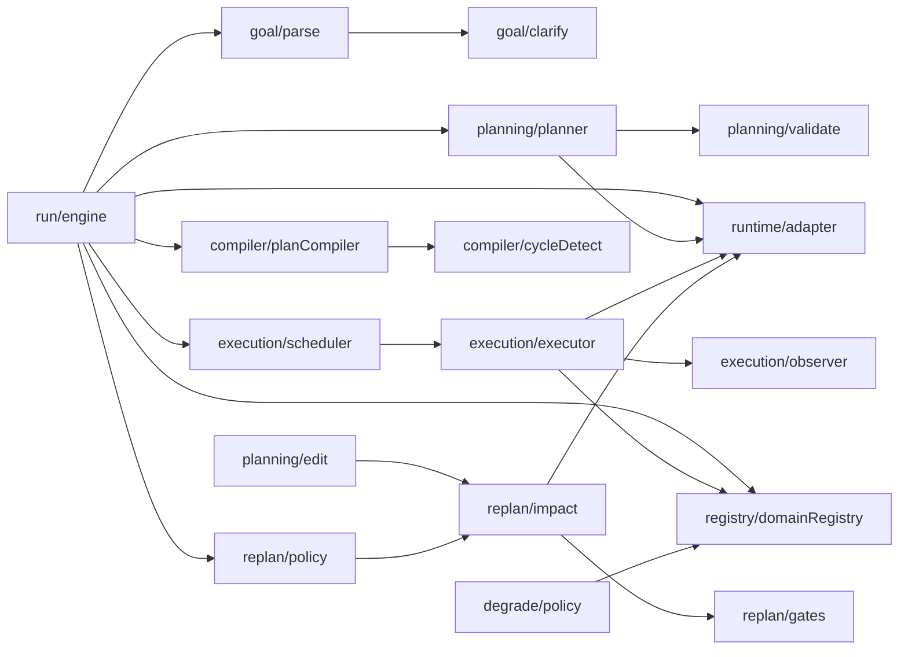
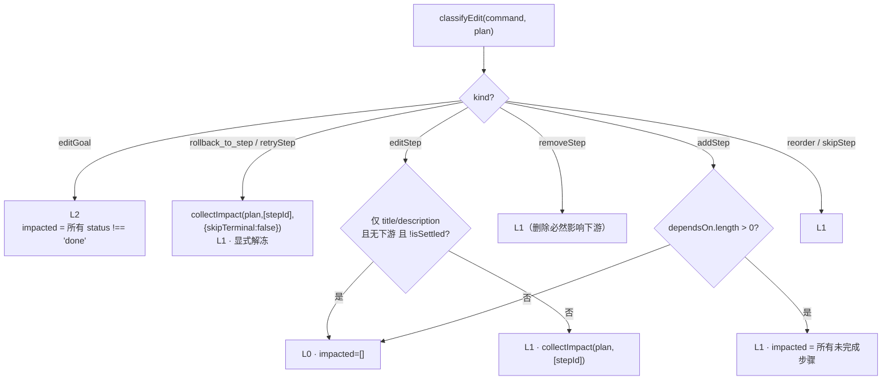
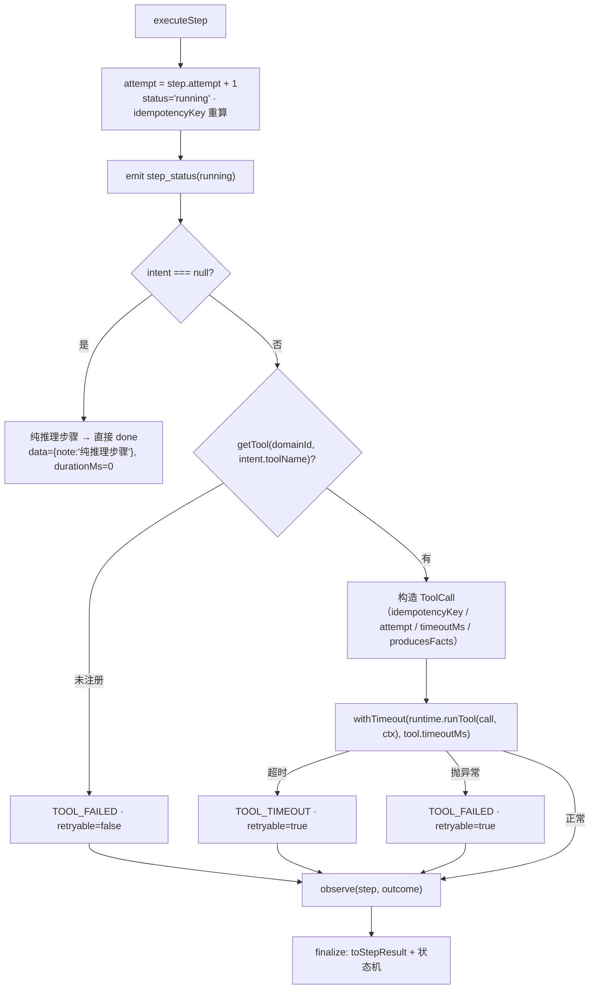
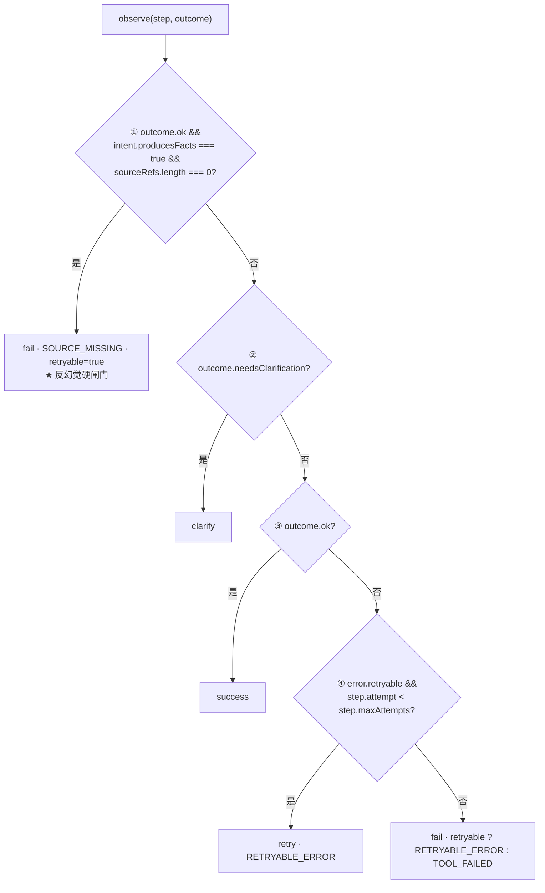
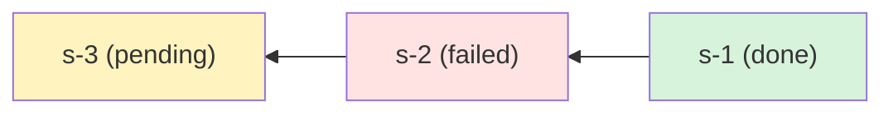
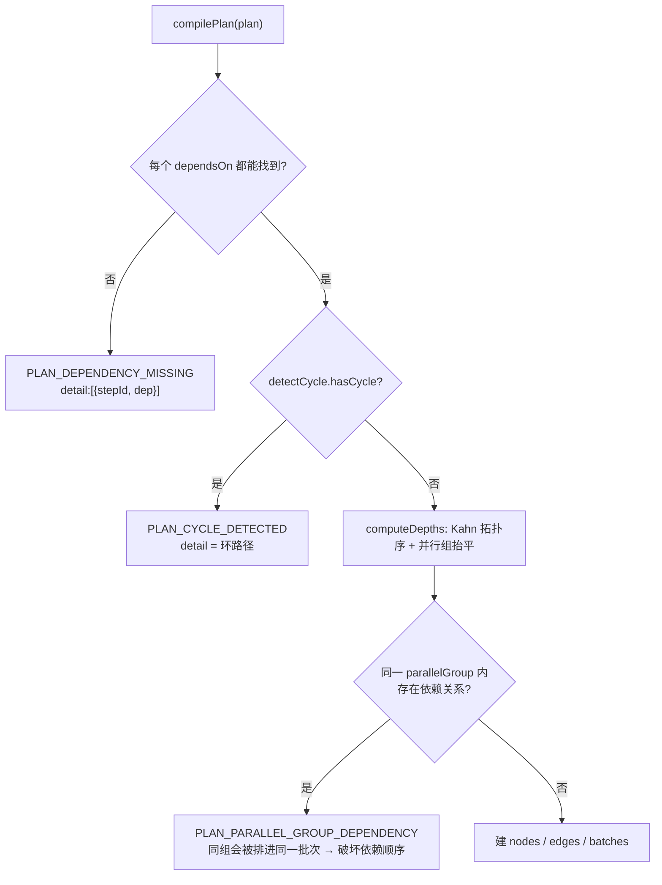
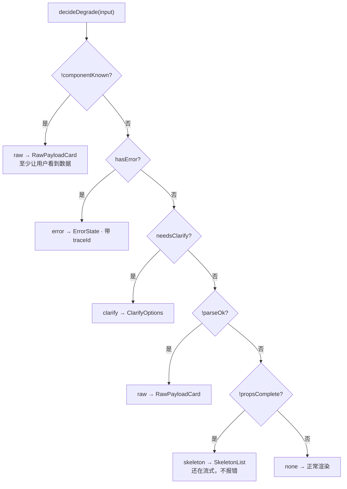
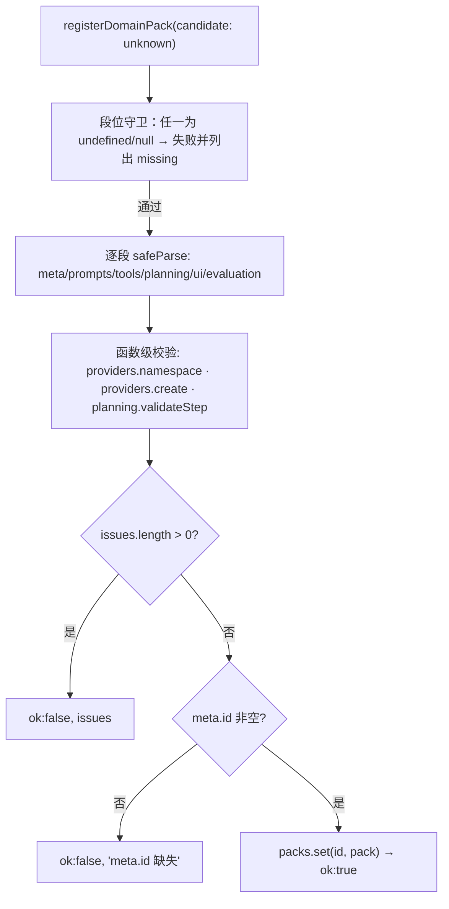
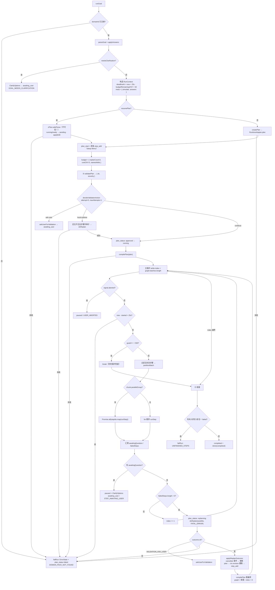

# 03 · 内核模块详解

> **对应 commit `dc9248c`（tag `m1-core-only`）**。所有函数签名、常量阈值、算法步骤均取自该 commit 源码。
>
> 读者：9 年经验前端，准备 AI Native 前端/全栈面试。目标是让你**讲得清每个内核模块的内部机制**，扛得住"调度怎么分批""重规划怎么算影响面""收敛判定怎么算的"这类追问。
>
> 不写面试话术（见 `07`），不写契约字段表（见 `02`）——但会在讲到模块时引用契约字段名。

---

## 0. 先立三条纪律

内核**领域无关**，这不是口号，是三条可 grep 验证的硬纪律：

| 纪律 | 落点 | 验证 |
|---|---|---|
| `src/core/**` 与 `shared/**` 零领域词 | 全部模块 | `grep -rnE "<领域词>" src/core shared \| wc -l` → **0**（本 commit 实测 0） |
| 内核只消费校验结果的 `ok` 与 `severity` | `planning/validate.ts` + `replan/policy.ts` | `grep -rn "\.code\|\.evidence\|\.suggestion" src/core` → **0** |
| 内核只依赖 `RuntimeAdapter` 接口 | `core/runtime/adapter.ts` | 内核无任何 SDK / 框架 import |

第 2 条最有意思：领域校验器可以往 `violations[]` 塞 `code / message / suggestion / evidence`，但它们在**类型层面**就是 `unknown`：

```ts
// shared/domain/types.ts
export const zViolation = z.object({
  severity: z.enum(['error', 'warning']),
  code: z.unknown().optional(),       // ← 内核不可读
  message: z.unknown().optional(),    // ← 内核不可读
  suggestion: z.unknown().optional(), // ← 内核不可读
  evidence: z.unknown().optional(),   // ← 内核不可读
});
```

一个只能看到 2 个信号的内核，怎么做"校验不通过该怎么办"的决策？答案在 §5.1 的 `decideValidationAction`——**判断集中在一张表里，不散落在 engine 里**。

---

## 1. 模块地图



一句话概括依赖方向：**engine 是唯一有"时间"的地方，其余全是纯函数 + 注入依赖**。纯函数 = 每个模块都能单独单测，不需要起服务、不需要 API Key。

---

## 2. `core/goal/*` —— 目标解析与澄清

### 2.1 `goal/parse.ts`：只抽"通用资源口径"

**职责 / 输入 / 输出**

```ts
export function parseGoal(
  input: { runId: string; raw: string; goalId?: string; now?: Date },
  options: Partial<ParseOptions> = {},
): ParsedGoal   // { goal: Goal; missingFields: string[] }  ← 空数组 = 信息足够
```

只抽四类对所有领域都成立的约束：预算 / 期限 / 数量 / 排除项。它不认识"景点""菜品""基金"——那些是领域的事。

**阈值**（`zParseOptions`）：`minRawLength = 6`（`raw.trim().length < 6` → 记 `goal.detail` 缺失）；`requireConstraints = false`（`true` 且一个约束都没识别 → 记 `constraint.generic` 缺失）。

**四条正则（真实常量）**

```ts
const BUDGET_PATTERN   = /(?:预算|花费|不超过|控制在|最多花|budget|cost)[^\d]{0,8}(\d+(?:\.\d+)?)\s*(元|块|rmb|cny|¥)?/i;
const DEADLINE_PATTERN = /(?:截止|期限|之前|deadline|due|before)[^\d天周月年]{0,6}(\d+\s*(?:天|周|月|年)|[^\s，,。；;]{1,12})/i;
const COUNT_PATTERN    = /(\d+)\s*(?:个|条|项|步|次|份)/;
const AVOID_PATTERN    = /(?:不要|避免|排除|不含|avoid|exclude|without)\s*([^\s，,。；;、]{1,20})/i;
```

**算法步骤**：① 四条正则各 `exec` 一次（**只取第一个匹配**）；② 命中的过一遍 `zGoalConstraint.parse`，原文片段存进 `raw` 保留溯源；③ 判定 `missingFields`（先看长度，再看 `requireConstraints`）；④ 抽 `resources`：`budgetCNY = Number(budget[1])`、`maxSteps = Number(count[1])`。

**一个值得记的细节**：

```ts
resources: Number.isNaN(resources.budgetCNY) ? {} : resources,
```

资源位"要么全有、要么空对象"，绝不塞 `NaN` 污染下游——下游一旦拿 `NaN` 做 `> maxCostCNY` 比较，结果恒为 `false`，成本闸门就**静默失效**了。

**边界纪律**：抽不出来**不硬猜**（C0-01），把缺失字段交回上层决定先澄清还是直接规划。

**单测**：`src/core/goal/parse.test.ts` · `describe('parseGoal')`（6 例）。

### 2.2 `goal/clarify.ts`：缺失字段 → 澄清问题

```ts
export function buildClarifyQuestions(goal: Goal): ClarifyQuestion[]
export function applyAnswers(goal: Goal, answers: Record<string, string>): Goal
export function needsClarification(goal: Goal): boolean
```

**模板表**（`QUESTION_TEMPLATES`，文案全部内核通用）

| 缺失字段 | prompt | 选项 id |
|---|---|---|
| `goal.detail` | 这个目标描述得还不够具体，希望我按哪种方式继续？ | `provide` / `skip` |
| `constraint.generic` | 还缺少约束条件，先告诉我最要紧的那一项？ | `budget` / `deadline` / `none` |
| `constraint.budget` ⚠️ | 这件事的预算上限是多少？ | `none` / `100` / `500` / `2000` |
| `constraint.deadline` ⚠️ | 希望什么时候之前完成？ | `none` / `1d` / `7d` / `30d` |

> ⚠️ **后两条在 M1 里是"未接线分支"**：`parseGoal` 只会产出 `goal.detail` 与 `constraint.generic` 两种缺失字段，而 dev 路径也不构造 `constraint.budget` / `constraint.deadline`，所以这两条模板（`clarify.ts:34`、`:43`）和对应的 `answerToConstraint` 分支（`:74`、`:79`）**当前不可达**。详见 §14-2。

**算法步骤**：取 `missingFields` → **`slice(0, 3)`**（最多问 3 条，避免追问轰炸）→ 查模板表，查不到**回落**到 `constraint.generic` → 问题 id 固定为 `` `clarify:${field}` ``，同时是 `answers` 的 key。

**回写逻辑**（伪代码）

```
for field of goal.missingFields:
    optionId = answers[`clarify:${field}`]
    if (!optionId) { remainingMissing.push(field); continue }   // 没回答 → 下次继续问
    c = answerToConstraint(field, optionId)
    if (c) constraints.push(c)                                  // 'skip'/'none'/'provide' → null
// 重算 resources.budgetCNY；返回 { ...goal, constraints, missingFields: remainingMissing }
```

**为什么"放弃补充"也算成功？** `skip / none / provide` 表示"用户明确说不用补了"，字段从 `missingFields` 移除 → `needsClarification` 变 `false` → 流程往下走。**澄清不能变成死循环**，这是设计上最容易被忽略的一点。

**依赖上游**：`shared/plan/types`（`zClarifyQuestion`、`GoalConstraint`）。
**单测**：`src/core/goal/parse.test.ts` · `describe('clarify')`（4 例，含"纯函数：不改动入参"）。

---

## 3. `core/planning/*` —— Planner / Validate / Edit

### 3.1 `planning/planner.ts`：模型输出是不可信输入

```ts
export async function createPlan(
  input: CreatePlanInput,   // { goal, ctx, domainId, revision?, signals? }
  deps: PlannerDeps,        // { runtime: RuntimeAdapter, now?: () => Date }
): Promise<CreatePlanResult> // { ok:true; plan } | { ok:false; error: AgentError }

export function buildSteps(
  draft: PlanDraft, options: BuildStepsOptions,
): { ok: true; value: Step[] } | { ok: false; error: AgentError }

export function applyReplanDraft(input: {
  plan: Plan; draft: PlanDraft; impactedIds: readonly string[];
  revision: number; reason: string; runId: string;
  now?: () => Date; makeId?: (index: number, draft: StepDraft) => string;
}): Plan
```

**算法步骤**：① `getDomainPack` 取不到 → `DOMAIN_PACK_NOT_FOUND`（`retryable: false`）；② 调 `deps.runtime.plan({ goal, stepTypes, templates, signals, revision }, ctx)`；③ **返回先过 `zPlanDraft.safeParse`**，失败 → `PLAN_GENERATION_FAILED`，`detail: parsed.error.issues.slice(0, 5)`（只带 5 条，不把整个 zod error 塞进事件流）；④ `buildSteps` 补齐运行态字段；⑤ `zPlan.parse` 出 `Plan`，`status: 'draft'`。

**`buildSteps` 补齐了什么**（草稿 → 可执行步骤）

| 字段 | 取值 | 来源 |
|---|---|---|
| `order` | 数组下标 | 本地 |
| `status` | `'pending'` | 本地 |
| `id` | `options.makeId?.(index, item) ?? item.id ?? makeStepId(index)` | 可注入（重规划用带 revision 的 id） |
| `idempotencyKey` | `makeIdempotencyKey(runId, id, 0)` = `` `${runId}:${id}:0` `` | `shared/plan/types` |
| `maxAttempts` | `getStepType(domainId, type)?.maxAttempts ?? 2` | **领域声明** |
| `origin` | `{ kind: 'planner', revision }` | 本地 |
| `dependsOn` | `item.dependsOn.slice()` | **拷贝**，不持有外部引用 |

顺带一道白名单闸门：`validateType(item.type)` 不通过 → `PLAN_GENERATION_FAILED`。**领域声明的 stepType 白名单是硬约束，模型不能凭空造类型**。

**`applyReplanDraft` —— 已完成步骤 id 不变的实现根据**

```ts
const impacted = new Set(input.impactedIds);
const remain   = input.plan.steps.filter((step) => !impacted.has(step.id)); // ← 含所有已完成步骤
const built    = buildSteps(input.draft, { ..., makeId: input.makeId });
const merged   = [...remain, ...(built.ok ? built.value : [])]
                   .map((step, index) => ({ ...step, order: index }));
```

已完成步骤**根本不在 `impactedIds` 里**（由 `collectImpact` 保证），所以原样留下。新步骤 `origin` 被打成 `{ kind:'replan', revision, parentStepId, reason }`。注意 `merged` 会**重排 `order` 但不重排 `id`**——id 稳定性是红线 14 的落点。

**依赖上游**：`RuntimeAdapter`、`domainRegistry`（`getDomainPack` / `getStepType` / `getTemplates`）。
**边界纪律**：只认 `step.type` 这类槽位；`templates` 只是透传给 Runtime，内核不解析其内容。
**单测**：无独立文件，由 `src/test/closedLoop.test.ts` 端到端覆盖。

### 3.2 `planning/validate.ts`：只吃两个信号

```ts
export async function validateStep(step: Step, ctx: RunContext): Promise<ValidationResult>
export async function validatePlan(plan: Plan, ctx: RunContext): Promise<ValidationResult>
export function highestSeverity(result: ValidationResult): 'error' | 'warning' | null
```

**步骤**：`validateStep` 先看 `getDomainPack`（拿不到 → `{ ok:false, violations:[{ severity:'error' }] }`，**只给 severity 不给 message**），再查内核白名单 `isAllowedStepType`，最后委托 `pack.planning.validateStep`。`validatePlan` = 逐步骤聚合 + `createValidator(domainId, ctx)` 的**计划级**校验。

```ts
// 内核只认 severity：有任一 error 即不通过。warning 不影响执行。
return { ok: !violations.some((v) => v.severity === 'error'), violations };
```

`highestSeverity` **优先取 error，与顺序无关**。于是内核拿到的组合只有三种语义：`ok=true`（放行）、`ok=false + error`（阻断）、`warning`（记录但不阻断）。

**边界纪律**：全文只有 `violation.severity` 一处属性访问，没有第二个。
**单测**：`src/test/validation.test.ts`（13 例，含"error 与 warning 同时存在 → 取 error，与顺序无关"）。

### 3.3 `planning/edit.ts`：L0/L1/L2 三档回写 + 已完成步骤冻结

| 档 | 触发 | 行为 | 成本 |
|---|---|---|---|
| **L0** | 只改未执行步骤的**文本**且**无下游** | 本地直接改，不重排 | 0 |
| **L1** | 影响下游 | 本地改 + 受影响步骤打回 `pending`，上层触发 `runtime.replan` | 低 |
| **L2** | 改了目标级约束 | 全量重排，`revision + 1` | 高 |

```ts
export function classifyEdit(command: EditCommand, plan: Plan): EditClassification
export function applyEdit(
  plan: Plan, goal: Goal, command: EditCommand,
  options: { runId: string; now?: Date; revision?: number } = { runId: '' },
): EditResult   // { ok:true; plan; goal; level; impactedStepIds } | { ok:false; reason:'FROZEN_STEP'|'STEP_NOT_FOUND' }

const TEXT_ONLY_FIELDS = new Set(['title', 'description']);
function isSettled(step: Step): boolean {   // 冻结门槛
  return step.status === 'done' || step.status === 'running';
}
```



**两种解冻语义（面试高频）**

```ts
case 'rollback_to_step':
case 'retryStep': {
  const impacted = new Set(classification.impactedStepIds);
  const steps = plan.steps.map((step) =>
    impacted.has(step.id) && step.status !== 'pending'
      ? { ...step, status: 'pending' as const,
          attempt: command.kind === 'retryStep' ? 0 : step.attempt,  // ← 只有 retryStep 清零
          result: undefined, error: undefined, updatedAt: now }
      : step);
  return { ok: true, plan: { ...plan, steps, updatedAt: now }, goal, level: 'L1', impactedStepIds: classification.impactedStepIds };
}
```

- `rollback_to_step`：该步及下游 → `pending`，**保留 `attempt`**（不白送重试次数）；
- `retryStep`：`rollback_to_step` + **`attempt = 0`** + 清 `result` / `error`（"这次不算，重来"）；
- 两者都走 `collectImpact(..., { skipTerminal: false })`——**这是唯一能把已完成步骤拉进影响面的开关**。

**L1 回写的双保险**（`withImpactedReset`）：

```ts
impacted.has(step.id) && step.status !== 'done'
  ? { ...step, status: 'pending' as const, updatedAt: now } : step
```

即使已完成步骤因 `skipTerminal:false` 进了影响面，这一行也会把它挡住。

**`skipStep` 为什么对已完成步骤也拒绝？** 因为"跳过"是**对未来的决策**，不是对过去的撤销。`done` 步骤的结果已被下游消费、已被渲染成组件节点（`emittedNodeIds`）；把它标成 `skipped` 会让"这一步到底发生过没有"变成不可判定——下游 `dependsOn` 还指向它，而 `result` 还在。**"跳过已完成的事"语义自相矛盾**，直接拒绝，要撤销走 `rollback_to_step`。

**边界纪律**：`classifyEdit` **完全不改计划**，只给结论——所以可被单测、可被"预演"（先算出要重排哪几步给用户看，再决定要不要执行）。
**依赖上游**：`replan/impact.collectImpact`。
**单测**：`src/core/planning/edit.test.ts`（12 例，含"★ 已完成步骤默认冻结 → FROZEN_STEP"与"★ rollback_to_step 解冻后可以改"）。

---

## 4. `core/execution/*` —— 调度 / 执行 / 观察

### 4.1 `execution/scheduler.ts`：拓扑分批 + `parallelGroup`

```ts
export const LIVE_STEP_STATUSES: readonly StepStatus[] = ['pending', 'ready', 'failed', 'awaiting_user'];
export function isLiveStepStatus(status: StepStatus): boolean
export function liveBatches(graph: ExecutionGraph, statuses: Map<string, StepStatus>): string[][]
export function partitionBatch(steps: readonly Step[]): ExecutionChunk[]
export function isBatchSettled(stepIds: readonly string[], statuses: Map<string, StepStatus>): boolean
export function markBatchReady(steps: readonly Step[], stepIds: readonly string[]): Step[]
```

**为什么状态用 `Map` 传入？** 源码注释："用 Map 传入以保持纯函数，不持有可变引用"。调度器永远不持有 `Plan`，只持有此刻的状态快照。

**`partitionBatch`（同组并行，其余顺序）**

```
chunks = []; seenGroups = new Set()
for step of steps:
    if step.parallelGroup:
        if seenGroups.has(step.parallelGroup): continue      // 同组只处理一次
        seenGroups.add(step.parallelGroup)
        chunks.push({ parallelGroup, stepIds: steps.filter(s => s.parallelGroup === step.parallelGroup).map(m => m.id) })
        continue
    chunks.push({ stepIds: [step.id] })                      // 无分组 → 单步块
```

`[s-1(collect), s-2(collect), s-3]` → `[{parallelGroup:'collect', stepIds:['s-1','s-2']}, {stepIds:['s-3']}]`。

**"批次"从哪来？** 从 `planCompiler` 算出的 `depth`（§6）。**调度器不做拓扑排序**——只消费编译器算好的批次。"纯函数链"的分工是：`compiler` 管结构，`scheduler` 管并发策略，`executor` 管单步状态机。

> **一处常见误解**：`liveBatches`（`scheduler.ts:27`）/ `isBatchSettled`（`:59`）/ `markBatchReady`（`:71`）**只被单测使用**，`engine.ts` 只 import 了 `partitionBatch` 与 `isLiveStepStatus`（活状态过滤是 engine 内联做的，`engine.ts:579-582`）。它们是**供外部编排/测试观测**的能力，引擎主循环未消费。详见 §14-5。

**单测**：`src/core/execution/scheduler.test.ts`（6 例）。

### 4.2 `execution/executor.ts`：重试 / attempt / 幂等 / 增量下发

**职责**：执行**单个**步骤。负责状态机流转与事件下发，**不解析步骤结果的语义**。

```ts
export async function executeStep(step: Step, ctx: RunContext, deps: ExecutorDeps): Promise<StepExecutionResult>
export async function emitResultComponents(step: Step, data: unknown, ctx: RunContext, deps: ExecutorDeps): Promise<string[]>
export function propsToPatches(props: Record<string, unknown>): JsonPatchOperation[]
export async function withTimeout<T>(promise: Promise<T>, timeoutMs: number, onTimeout: () => T): Promise<T>
```

常量：`DEFAULT_STREAM_DELAY_MS = 80`。



**幂等键三段式** `` `${runId}:${stepId}:${attempt}` `` **带 attempt**——"重试"不是同一键重放，而是新键，工具实现可据此区分第几次尝试。

**状态机映射**（`finalize`）：`success → done`（随后 `emitResultComponents`）、`retry → pending`（保持可调度）、`clarify → awaiting_user`、`fail → failed`。

**props → JSON Patch**（红线 7：只发一遍，绝不整包重发）

```ts
if (Array.isArray(value)) {
  for (const item of value) operations.push({ op: 'add', path: `/${key}/-`, value: item });  // 列表逐条长出
  continue;
}
operations.push({ op: 'replace', path: `/${key}`, value });   // 标量
```

组件未注册时**不白屏**：`const component = known ? renderer.component : 'RawPayloadCard'`，`component_end` 的 status 为 `'degraded'`。

**边界纪律**：内核只做转发，props 由领域的 `stepRenderers.toProps` 产出，内核**不认识任何一个 props 字段名**。
**依赖上游**：`RuntimeAdapter.runTool`、`domainRegistry`（`getTool` / `getStepRenderer` / `getComponentDefinition`）、`observer`。
**单测**：无独立文件，由 `closedLoop.test.ts` 覆盖（`component_start/delta/end` 三连事件、retry 路径 `attempt >= 2`）。

### 4.3 `execution/observer.ts`：反幻觉硬闸门

```ts
export const zObservationKind = z.enum(['success', 'retry', 'clarify', 'fail']);
export function observe(step: Step, outcome: ToolOutcome): Observation
export function toStepResult(outcome: ToolOutcome, durationMs: number): StepResult
export function toReplanTrigger(observation: Observation):
  'RETRYABLE_ERROR' | 'FATAL_ERROR' | 'LOW_CONFIDENCE' | 'ENV_ERROR' | 'PROVIDER_VALIDATION_FAILED'
```

**判定顺序（顺序即优先级）**



**① 为什么在第一位？** 红线 16 的落点：`producesFacts === true` 的步骤，结果**必须**带 `SourceRef`。哪怕工具自己报 `ok: true`，没来源就判失败——**"成功但无来源"比"失败"危险得多**，它会把模型编造的数据当事实上屏。

**④ 的计数细节（容易讲错）**：这里的 `step.attempt` 是**已自增过的值**（`executeStep` 先 `attempt = step.attempt + 1`）。以 `maxAttempts = 2` 为例：第 1 次进入时 `attempt = 1`，`1 < 2` → `retry`；第 2 次 `attempt = 2`，`2 < 2` → `fail`。所以语义是"**最多跑 2 次**"，不是"最多重试 2 次"。

**trigger 枚举**（内核通用）：`PROVIDER_VALIDATION_FAILED / SOURCE_MISSING / TOOL_FAILED / TOOL_TIMEOUT / ENV_ERROR / RETRYABLE_ERROR / FATAL_ERROR`。
**边界纪律**：不读任何领域语义，只看 `ok`、`retryable`、`needsClarification`、`sourceRefs.length`、`producesFacts`。
**单测**：无独立文件，反幻觉由 `closedLoop.test.ts` 的"事实必须带来源"覆盖（先断言"确实存在 producesFacts 的步骤"再逐个断言 `sourceRefs.length > 0`，避免 0 断言假通过）。

---

## 5. `core/replan/*` —— 策略表 / 影响面 / 闸门

### 5.1 `replan/policy.ts`：决策集中在一张表

```ts
export const zReplanTrigger = z.enum([
  'STEP_TIMEOUT','RETRYABLE_ERROR','FATAL_ERROR','NEW_INFO','LOW_CONFIDENCE',
  'USER_EDIT','GOAL_CONSTRAINT_CHANGED','ENV_ERROR','PROVIDER_VALIDATION_FAILED',
]);   // 9 个，禁止领域专有码
export const zReplanStrategy = z.enum(['retry-step','local-subtree','full-replan','ask-user','cancel-subtree']);
export function decideStrategy(input: StrategyInput): ReplanStrategy
```

| 触发 | 条件 | 策略 |
|---|---|---|
| `STEP_TIMEOUT` / `RETRYABLE_ERROR` / `ENV_ERROR` | `attempt < maxAttempts` | `retry-step` |
| 同上 | 次数已用尽 | `local-subtree` |
| `FATAL_ERROR` / `NEW_INFO` / `USER_EDIT` | — | `local-subtree` |
| `PROVIDER_VALIDATION_FAILED` | `severity === 'warning'` | `ask-user` |
| `PROVIDER_VALIDATION_FAILED` | `severity === 'error'` | `local-subtree` |
| `LOW_CONFIDENCE` | — | `ask-user` |
| `GOAL_CONSTRAINT_CHANGED` | — | `full-replan` |

**★ `decideValidationAction` —— 只吃 4 个入参**

```ts
export function decideValidationAction(input: {
  ok: boolean; severity: 'error' | 'warning' | null; attempt: number; maxAttempts: number;
}): 'continue' | ReplanStrategy {
  if (input.ok) return 'continue';
  if (input.severity !== 'error') return 'continue';           // warning 不阻断
  if (input.attempt >= input.maxAttempts) return 'ask-user';    // 用尽 → 转人工
  return decideStrategy({ trigger: 'PROVIDER_VALIDATION_FAILED', ... });
}
```

**这 4 个入参就是内核从校验里拿到的全部信息**——没有 `code`、没有 `message`、没有 `evidence`。单测专门有一例"★ 入参只有 ok/severity/attempt/maxAttempts：不接收任何领域字段"来钉死它。

> **别写成"支持 5 种策略"**：`zReplanStrategy` 枚举里有 5 个值（`policy.ts:23-30`），但 `cancel-subtree`（`:28`）**从未被 `decideStrategy` 返回**，是死分支。当前实际可达的只有 4 种：`retry-step` / `local-subtree` / `full-replan` / `ask-user`。详见 §14-4。

**边界纪律**：输入只认内核通用触发码与 `severity`，不读任何领域语义。
**单测**：`src/test/validation.test.ts` · `describe('decideValidationAction')`（5 例）。

### 5.2 `replan/impact.ts`：反向收集下游子树

**职责**：给定"种子步骤"（通常是失败的那一步），算出哪些步骤需要重排。**这是"局部重规划"与"已完成步骤冻结"的共同根据**。

```ts
export function collectImpact(
  plan: Plan, seedIds: readonly string[], opts: { skipTerminal?: boolean } = {},  // 默认 true
): ImpactSet
export const zImpactSet = z.object({
  impactedIds: z.array(z.string()).default([]),        // 需要重排（已完成步骤已被剔除）
  frozenIds:   z.array(z.string()).default([]),        // 被冻结的已完成步骤
  resumeFrom:  z.string().nullable().default(null),    // 影响面内最早的未完成步骤
});
export function completedStepIds(plan: Pick<Plan, 'steps'>): string[]
export function brokenCompletedIds(before, after): string[]   // 空数组 = 通过
```

**算法步骤（BFS on 反向边）**

1. 建 `byId`（id → Step）与 `dependents`（`dep → [依赖它的 stepId]`）——**反向邻接表**；
2. 种子入队：若 `skipTerminal && status === 'done'` → 不进 `impacted`，改记 `frozenIds`（**天然冻结**）；
3. 出队扩散：下游同样 `done` 的记 `frozenIds` 并**停止扩散**（不穿透已完成步骤继续往下走）；
4. `impactedList` 按 `plan.steps` **原顺序**输出（保证确定性，不是 BFS 顺序）；
5. `resumeFrom = plan.steps.find(s => impacted.has(s.id))?.id ?? null`。



`collectImpact(plan, ['s-2'])` → `{ impactedIds:['s-2','s-3'], frozenIds:[], resumeFrom:'s-2' }`
`collectImpact(plan, ['s-1'])` → `{ impactedIds:[], frozenIds:['s-1'], resumeFrom:null }`

`brokenCompletedIds` 判三条：`after` 里**存在同 id**、`status === 'done'`、**`type` 未变**。任一不满足即破损——这是红线 14 的可执行断言。

**依赖上游**：`shared/plan/types`。
**单测**：`src/core/replan/impact.test.ts`（7 例，含"传递闭包：只收直接依赖不算够"、"已完成步骤被改了类型也算破损"）。

### 5.3 `replan/gates.ts`：三重闸门 + 收敛判定

**真实阈值常量**

```ts
// gates.ts:15-24
export const zGateConfig = z.object({
  maxReplans:    z.number().int().positive().default(5),
  maxCostCNY:    z.number().positive().default(2),        // ★ 单位是「元」，不是分
  maxDurationMs: z.number().positive().default(25_000),   // 单位 ms
  minDelta:      z.number().nonnegative().default(0.15),  // delta 低于此值 = 原地打转
});
export const DEFAULT_GATE_CONFIG: GateConfig = zGateConfig.parse({});
export const zGateReason = z.enum(['MAX_REPLANS','MAX_COST','MAX_DURATION','NO_CONVERGENCE']);
```

`DEFAULT_GATE_CONFIG` 的真实值：`maxReplans = 5`、`maxCostCNY = 2`（**元**）、`maxDurationMs = 25_000`（**ms**）、`minDelta = 0.15`。单测用 `costCNY: 2.01` 验证被拦（`gates.test.ts:32`），用 `costCNY: 2` 验证边界放行——**单位确实是元**。

```ts
export function checkGates(budget: ReplanBudget, nowMs: number, config = DEFAULT_GATE_CONFIG): GateOutcome {
  if (budget.replanCount >= config.maxReplans) return { allowed: false, reason: 'MAX_REPLANS' };
  if (budget.costCNY     >  config.maxCostCNY) return { allowed: false, reason: 'MAX_COST' };
  if (nowMs - budget.startedAtMs > config.maxDurationMs) return { allowed: false, reason: 'MAX_DURATION' };
  return { allowed: true };
}
```

注意 `>=` 与 `>` 的差异：`replanCount` 用 `>=`（第 5 次成功后再来就拦），`costCNY` / `duration` 用 `>`（恰好等于上限仍放行）。单测有专门边界用例：`checkGates({ replanCount:4, costCNY:2 }, 25_000)` → allowed。

**delta = `1 - Jaccard(步骤签名集合)`**，三个入口函数别搞混：

| 函数 | 比较域 | 谁在用 |
|---|---|---|
| `computePlanDelta(before, after)` | 任意两组步骤 | 底层实现 |
| `planDelta(before, after)` | **整个计划** | 仅测试与诊断 |
| `subtreeDelta(replaced, generated)` | **受影响子树** | **闭环用的就是这个** |

`isStagnant(delta)` = `delta < 0.15`；`evaluateReplan` **先闸门后收敛**（硬约束优先于软约束）。

**单测**：`src/core/replan/gates.test.ts`（20 例，含"★ 收敛判定的比较域"整组）。

---

## 6. `core/compiler/*` —— PlanCompiler（纯函数 + 环检测）

### 6.1 `compiler/cycleDetect.ts`

```ts
export function detectCycle(steps: readonly Pick<Step, 'id' | 'dependsOn'>[]): CycleDetectResult
// { hasCycle: boolean; cycle: string[] }   // cycle 形如 ['a','b','a']
```

Kahn 拓扑排序：能全部出队则无环；否则 `visited < steps.length` 说明有环，再用 DFS（`state: 0 未访问 / 1 访问中 / 2 已完成`）从"入度仍 > 0"的节点出发**取出一条具体环路径**用于报错。

两个细节：① `const deps = new Set(step.dependsOn.filter(d => known.has(d)))`——**同一 dep 重复出现只算一次**（否则入度被重复累加，无环图会被误判成有环）；**指向不存在节点的依赖不构成环**，由 `planCompiler` 单独报 `PLAN_DEPENDENCY_MISSING`。② 报错给**具体路径**而不是"有环"两个字——计划是模型生成的，你得能指给它看"是 s-2 → s-3 → s-2 这一圈"。

**单测**：`src/core/compiler/cycleDetect.test.ts`（5 例，含自环与"指向不存在节点不算环"）。

### 6.2 `compiler/planCompiler.ts`

红线 12：**必须纯函数（可单测、含环检测），不得放在 runtime 目录**。IR 为 `ExecutionGraph { planId, domainId, revision, nodes[], edges[], batches[][] }`，`ExecutionNode { stepId, type, depth, dependsOn, parallelGroup, status }`。

```ts
export function compilePlan(plan: Plan): CompileResult
// { ok:true; graph } | { ok:false; error: AgentError; cycle: string[] }
```



**`computeDepths`（分层算法，最难讲的一段）**

1. `topologicalOrder(steps)` 走一遍 Kahn 得线性序；
2. 按线性序算 `depth = max(depth(dep) + 1)`；
3. **抬平并行组**：同 `parallelGroup` 成员必须落在同一批次，把组内 depth 统一抬到 `groupMax`；
4. 抬平后**向下游传播**（`value > depth.get(id)` 就更新）；
5. 迭代上限 = `steps.length`，`if (!changed) break`——**保证必然终止**。

```ts
for (let round = 0; round < steps.length; round += 1) {
  let changed = false;
  /* ① 算 groupMax  ② 组成员抬到 groupMax  ③ 按拓扑序向下游传播 */
  if (!changed) break;
}
```

`buildBatches`：按 depth 分桶 → 桶内按 `order` 排，相同再按 `id.localeCompare`（**稳定排序，保证纯函数确定性**）。

第 3 条失败路径的理由：同组内 A 依赖 B 会被排进同一批次**并发执行**，依赖顺序直接被破坏。宁可编译失败，也不产出执行时会乱序的图。

**单测**：`src/core/compiler/planCompiler.test.ts`（6 例，含"纯函数：同样入参产出同样图，且不改动入参"）。

---

## 7. `core/degrade/*` —— 三级降级（绝不白屏）

```ts
export const zDegradeLevel = z.enum(['none','skeleton','raw','clarify','error']);
export function decideDegrade(input: DegradeInput): DegradeDecision   // { level, component, reason }
export function isPropsComplete(props: Record<string, unknown>, requiredProps: readonly string[]): boolean
```

**兜底链**（`CORE_DEGRADE_CHAIN`，领域未声明时用）：`rawPayload: RawPayloadCard` / `clarify: ClarifyOptions` / `error: ErrorState` / `skeleton: SkeletonList`。



**顺序为什么是这样？** "组件没注册"排在"有错误"之前：组件都没了，错误态也没地方渲染，只能先摆原始载荷。"props 还没流完"排最后且**不报错**：流式过程中 props 天然不全，那是正常状态不是故障。

**★ 为什么用 `z.input` 而不是 `z.infer`？** 本节最值钱的细节：

```ts
export const zDegradeInput = z.object({
  componentKnown: z.boolean().default(true),
  parseOk:        z.boolean().default(true),
  propsComplete:  z.boolean().default(true),
  hasError:       z.boolean().default(false),
  needsClarify:   z.boolean().default(false),
  chain:          zDegradeChain.default(CORE_DEGRADE_CHAIN),
});
export type DegradeInput = z.input<typeof zDegradeInput>;   // ← 关键
```

zod 里带 `.default()` 的字段在**入参类型（input）**里可选，在**出参类型（output）**里必填。用 `z.infer`（= output）会强制调用方把 6 个字段**全部显式写出**——`.default()` 的默认值对类型而言形同虚设，写漏一个就编译不过，最后大家干脆手抄一遍 `true,true,true,false,false`。用 `z.input` 才能让默认值真的是默认值：

```ts
// ComponentRenderer.tsx —— 只传需要的字段
const decision = decideDegrade({
  componentKnown: definition !== undefined && definition.load !== undefined,
  parseOk: parsed?.success ?? false,
  propsComplete: definition ? isPropsComplete(node.props ?? {}, definition.requiredProps) : false,
  hasError: node.status === 'error', needsClarify: false, chain,
});
```

单测还有一例钉死"绝不白屏"：`expect(decideDegrade(input).component.length).toBeGreaterThan(0)`——**每个分支都必须返回非空组件名**。

**依赖上游**：`shared/domain/types`（`CORE_DEGRADE_CHAIN`）。**调用点**：`src/components/generative-ui/ComponentRenderer.tsx`（唯一渲染入口）。
**单测**：`src/core/degrade/policy.test.ts`（11 例，含"优先级：错误 > 澄清 > 校验失败 > 骨架"）。

---

## 8. `core/registry/*` —— 注册表 + 完整性守卫

```ts
export function registerDomainPack(candidate: unknown): RegisterResult
// { ok:true; pack } | { ok:false; missing: string[]; issues: string[] }
export const REQUIRED_DOMAIN_PACK_SEGMENTS = [        // shared/domain/types.ts:321-329
  'meta','tools','providers','ui','prompts','planning','evaluation',
] as const;                                            // ← 7 项，这是注册守卫的判据
```

**★ 段数口径（面试里最容易被打脸的一条）：`DomainPack` 共 8 段，其中 7 段必填、`lifecycle` 可选。**

- `zDomainPack` 有 8 个成员，第 8 个是 `lifecycle?: DomainLifecycle`（`shared/domain/types.ts:317`，源码注释在 `:295` 写作「⑧ lifecycle（可选）」）；
- 注册守卫的判据是常量 `REQUIRED_DOMAIN_PACK_SEGMENTS`，里面**只有 7 个**——`lifecycle` 不在其中；
- 所以"`REQUIRED_DOMAIN_PACK_SEGMENTS` 有 7 项"和"Domain Pack 有 8 段"**不矛盾**，是两个不同问题的答案。

准确说法：**"总共 8 段，7 段必填（缺一段注册失败），第 8 段 `lifecycle` 可选；注册守卫看 `REQUIRED_DOMAIN_PACK_SEGMENTS`，它只有 7 项。"** 说"8 段必填"会被追问打脸。

除 7 段位守卫外，注册表还额外做**两项函数级校验**：`providers.namespace` / `providers.create`（`domainRegistry.ts:113-118`）与 `planning.validateStep`（`:119-121`）。



**为什么入参是 `unknown`？** 源码注释："可能来自配置文件 / 动态 import"。注册表是**边界**，边界数据一律不可信。

**为什么 `prompts` 必须含 `antiHallucination`？** 那是内核强制注入的反幻觉硬插槽——领域不能"忘了写反幻觉提示词"（`zDomainPrompts.antiHallucination: z.string().min(1)`）。

**查询 API 一律"未注册就返回空/兜底，不抛错"**：`getDomainPack` / `listDomainPacks` / `listDomainIds` / `clearDomainPacks`(测试) / `getStepTypes` / `getStepType` / `isAllowedStepType` / `getTemplates` / `getTool` / `getStepRenderer` / `getComponentDefinition` / `getDegradeChain`(回落 `CORE_DEGRADE_CHAIN`) / `createProviders` / `createValidator`。唯一例外 `requireDomainPack` 会 `throw`——**有意为之的启动期断言，不是运行期分支**。

**单测**：`src/core/registry/domainRegistry.test.ts`（10 例，含"★ 段值为 null 也算缺失"、"非对象入参 → 全部必填段缺失"）。

---

## 9. `core/runtime/*` —— RuntimeAdapter 与 MockRuntime

### 9.1 `runtime/adapter.ts`：内核唯一可见的执行接口

```ts
export interface RuntimeAdapter {
  readonly id: string;                                              // 'mock' / 'mastra'
  plan(request: PlanRequest, ctx: RunContext): Promise<PlanDraft>;
  replan(request: ReplanRequest, ctx: RunContext): Promise<PlanDraft>;
  runTool(call: ToolCall, ctx: RunContext): Promise<ToolOutcome>;
}
```

**只有三个方法**——这就是红线 13（内核只依赖接口）的全部内容。将来接 Mastra 只要实现这三个方法，**内核一行不改**。请求/返回全是 zod schema，所以**接口边界本身就是不可信边界**。

两个关键字段：`zReplanRequest.retainedSteps`（被保留的快照，**含已完成步骤**，供 runtime 重写依赖）与 `impactedSteps`（将被替换的快照）；`zToolCall.producesFacts`（来自 `ToolSpec.producesFacts`，`true` 时返回必须带 `SourceRef`）、`timeoutMs` 默认 `10_000`。

`replan` 的注释里有一句硬约束：**"已完成 step 的 id 由内核保留，runtime 不得复用已完成 id"**——这是接口层面的约定，不靠实现自觉。

### 9.2 `runtime/mock/*`：连模型也 mock（零网络零密钥）

```ts
export function createMockRuntime(options: MockRuntimeOptions = {}): RuntimeAdapter
const DEFAULT_LATENCY_MS = 120;   // runTool 的 sleep = Math.min(latencyMs, 60)，避免大计划耗光 25s 闸门
```

**`plan()`：回放领域声明的模板，不在内核写死任何领域步骤**

```ts
const template = request.templates[0];
if (template) return { summary: ..., steps: template.steps.map(...) };
// 兜底：每个声明过的 stepType 一步，线性串联（纯推理，不调工具）
```

`templates` 来自 `pack.planning.templates`，所以"模型产出什么计划"**由领域决定**，内核只透传。

**`replan()`：唯一影响 delta 的旋钮**

```ts
export type MockReplanMode = 'stagnant' | 'diverge';   // 默认 'diverge'
const title = mode === 'diverge'
  ? `${label ?? step.type} · 重排 ${revision}`   // 脚本化模型"换了方案"
  : step.title;                                   // 连标题都不动 → delta = 0
// 依赖重写：dependsOn.map(dep => idMap.get(dep) ?? dep)
//         被替换的依赖指向新 id；被保留的依赖（含已完成步骤）原样保留
```

新 id = `makeReplanStepId(revision, index)` = `` `r${revision}-${index + 1}` ``（如 `r2-1`）。那一行依赖重写就是"已完成 step id 不变"在重排后仍成立的原因。

源码里有句很硬的注释，值得原样记住：

> ★ 这里**不再**偷偷多追加一步来把 delta 抬过阈值 —— 那样会掩盖收敛判定的 bug。差异必须是显式的、可切换的、可被测试证伪的。

**`tool()`：四种故障注入**（从 `ctx.meta['simulate']` 读，内核只做字符串匹配，不解析语义）

| `simulate` | 行为 | 用来观察 |
|---|---|---|
| `none` | 委托领域 ToolSpec | 正常路径 |
| `retryable` | `call.attempt <= 1` 时失败一次 | `retry-step` |
| `fatal` | **整轮只注入一次** | `local-subtree` 重规划 |
| `clarify` | 返回 `needsClarification` + question；带答案重跑自动放行 | `ask-user` |

`fatal` 只注入一次是关键：否则重排后的新步骤又会失败，永远收敛不了。状态放工厂闭包：

```ts
export function createDefaultMockScript(options: MockScriptOptions = {}): MockScript {
  const state: MockScriptState = { fatalInjected: false };
  const mode: MockReplanMode = options.replanMode ?? 'diverge';
  return { plan: ..., replan: ..., tool: (call, ctx) => toolCall(call, ctx, state) };
}
export const defaultMockScript: MockScript = createDefaultMockScript();
```

**为什么用工厂而不是共享常量？** 源码注释："故障注入需要'整轮只注入一次'的状态，多个 run 之间必须互相隔离。" `defaultMockScript` 只适合"一次 run 跑完即结束"（如单测）；闭环测试里每个 run 都新建实例，否则故障注入状态会跨 run 泄漏。

**工具输入同样不可信**：`tool.inputSchema.safeParse(call.input)`，失败用原始输入兜底。
**单测**：由 `closedLoop.test.ts` 与 `edgeCases.test.ts` 覆盖（后者直接注入自定义 `MockScript` 构造 25 步计划、全失败、含环等场景）。

---

## 10. `core/run/engine.ts` —— 编排主循环（系统的心脏）

```ts
export async function runGoal(input: EngineInput, deps: EngineDeps): Promise<EngineResult>
// EngineInput : { goal, domainId?, simulate?, requireConstraints?, answers?, resumePlan?, edit? }
// EngineDeps  : { runtime, emit, sleep?, signal?, now?, streamDelayMs? }
// EngineResult: { status: RunTerminalStatus, plan: Plan | null, traceId, reason? }
export function resumePlan(raw: Plan, edit: EditCommand | null | undefined, goal: Goal, runId: string):
  { ok:true; plan: Plan; cancelledIds: string[] } | { ok:false; message: string; reason: string }
```

常量：`DEFAULT_STEP_DELAY_MS = 90`（逐条长出）、`DEFAULT_COMPONENT_DELAY_MS = 60`（props 增量间隔）。

### 10.1 主循环详细流程



### 10.2 六个必须讲清的实现细节

**① 续跑快照来自客户端 → 不可信**

```ts
const parsed = zPlan.safeParse(raw);
if (!parsed.success) return { ok:false, message:'续跑的计划快照未通过 schema 校验', reason:'RESUME_PLAN_INVALID' };
```

不静默吃脏数据。归一化还做了 `running/ready → pending`（被中断的步骤重新排队）。

**② 上下文跟随计划版本**：`ctx = { ...ctx, revision: plan.revision }`——注释写明用途："Runtime 可据此区分'重排前后的同名步骤'"。

**③ 失败汇聚：一批次只触发一轮重规划**

```ts
/** 本批次内所有失败步骤：汇聚成一次重规划，而不是每个失败各触发一轮。 */
const failedSteps: Step[] = [];
```

并行组里两步同时失败时，若各触发一轮，闸门计数会瞬间飙到上限，且第二轮的 `plan` 基线已过期。**先收集、后一次性重排**是这个循环的骨架决策。

**④ 并发写 `plan` 为什么不会 lost update**

```ts
plan = replaceStep(plan, result.step);   // 在赋值时读取 plan，而非进入时快照
```

`Promise.all` 里两个 `runStep` 并发，但 `replaceStep(plan, ...)` 的 `plan` 是**执行到这一行时**才读取的（闭包捕获变量不是值）。A 先写、B 后写，B 读到 A 写完的结果，两份更新都保留。**若写成 `const base = plan; ... plan = replaceStep(base, ...)` 就会丢更新**——这是纯粹的"读时机"决策。

**⑤ `doReplan` 完整顺序（闸门被查了两次）**

```ts
const strategy = decideStrategy({ trigger, severity, attempt, maxAttempts });
if (strategy === 'retry-step') return { ok:false, reason:'RETRY_EXHAUSTED' };
if (strategy === 'ask-user')   return { ok:false, reason:'ASK_USER' };

const impact = strategy === 'full-replan' ? {...} : collectImpact(before, seedIds);
if (impact.impactedIds.length === 0) return { ok:false, reason:'NOTHING_TO_REPLAN' };

const gated = checkGates(budget, now().getTime(), DEFAULT_GATE_CONFIG);   // ← 第一次：省钱，别白调模型
if (!gated.allowed) return { ok:false, reason: gated.reason };

const draft     = await deps.runtime.replan({...}, ctx);
const candidate = applyReplanDraft({ ..., makeId: (i) => makeReplanStepId(revision, i) });

const replaced  = before.steps.filter((s) => impact.impactedIds.includes(s.id));
const generated = candidate.steps.filter((s) => !beforeIds.has(s.id));   // 新 id 必带 r{revision}- 前缀
const delta     = subtreeDelta(replaced, generated);                     // ← 子树 delta

const verdict = evaluateReplan({ budget, nowMs: now().getTime(), delta }); // ← 第二次：闸门 + 收敛
if (!verdict.allowed) return { ok:false, reason: verdict.reason };

const postAction = decideValidationAction({ ...(await validateCurrent(candidate)),
                     attempt: params.attempt + 1, maxAttempts: params.maxAttempts });  // ← 注意 +1
if (postAction === 'ask-user')  return { ok:false, reason:'VALIDATION_ASK_USER' };
if (postAction !== 'continue')  return { ok:false, reason:'VALIDATION_FAILED' };

budget.replanCount += 1;
budget.costCNY += 0.05;
```

第一次 `checkGates` 是**成本优化**（别为注定被拦的重排付模型钱），第二次 `evaluateReplan` 才是裁决（内部会再跑一次闸门）。

`attempt: params.attempt + 1` 的 `+1` 很关键：**重排本身已消耗一次尝试**，再用尽就转人工，绝不无限重排。所以主校验路径（`maxAttempts:1, attempt:0`）的结局是：重排一次 → 复校验 → `1 >= 1` → `ask-user`（单测断言 `awaiting_user` / `VALIDATION_ASK_USER`，且**没有任何一步进入 done**）。

**⑥ 成本账目**：每步 `costCNY += result.step.estimate?.costCNY ?? 0.01`（兜底 1 分），每轮成功重排 `+= 0.05`。5 轮重排约 `0.25` 元，**远低于 ¥2**——实际生产中先触发的是 `MAX_REPLANS`（5 次），成本闸门是防御性第二道。这笔账值得讲清，否则"成本 ≤¥2"听起来像拍脑袋。

**单测**：`src/test/closedLoop.test.ts`（10 例）+ `src/test/edgeCases.test.ts`（7 例）。

---

## 11. ★ 专题一：收敛判定（面试必追问）

建议**照着源码讲**，因为它踩过坑——讲得出踩过的坑，比讲得出设计更可信。

### 11.1 `stepSignature` 为什么不含 id

```ts
// shared/plan/types.ts
export function stepSignature(step: Pick<Step, 'type' | 'title'>): string {
  return `${step.type}|${normalizeTitle(step.title)}`;
}
export function normalizeTitle(title: string): string { return title.trim().toLowerCase(); }
```

源码注释已把 bug 写死：

> ★ **刻意不含 `id`**：重排必然生成新 id（否则无法与历史步骤区分），若把 id 计入签名，delta 恒等于 1，收敛判定永远不可能触发 —— 那是个数学上的死规则。只比"这一步**做什么**"（类型 + 归一化标题），不比"它是谁"。

把 bug 推演一遍：① 重排必生成新 id（`r2-1`、`r2-2`…），原 id（`s-3`）与新 id 在集合里**没有任何交集**；② 若签名含 id，交集恒为 **0**；③ `delta = 1 - 0/union = 1`；④ `isStagnant(1)` = `1 < 0.15` = **false** → 永远"已收敛"；⑤ `NO_CONVERGENCE` 成了**数学上不可达的死规则**——代码写了、测试没覆盖、线上永不触发。**这才是最危险的 bug：一条你以为在保护你的规则，其实从来没生效过。**

**修法**：签名去掉 id，只留 `type` + `normalizeTitle(title)`。这样重排结果与上次一模一样时交集 = 并集，`delta = 0` → `NO_CONVERGENCE` 可达。单测专门钉死这个不变量：

```ts
it('只改 id 不算变化：同 type + 同 title → delta 0（stepSignature 不含 id）', () => {
  expect(computePlanDelta([makeStep({ id:'s-1', title:'同一步' })],
                          [makeStep({ id:'r2-0', title:'同一步' })])) .toBe(0);
  expect(subtreeDelta([makeStep({ id:'s-1', title:'同一步' })],
                      [makeStep({ id:'r2-0', title:'同一步' })])) .toBe(0);
});
```

### 11.2 为什么比"受影响子树"而不是整个计划

这是**第二个 bug**，方向相反（误杀而非漏放）：

- 25 步计划，只有第 25 步失败；影响面 = 它自己（无下游），只替换 1 步；
- 若按**整个计划**算：交集 24、并集 26 → `delta = 1 - 24/26 ≈ 0.0769`；
- `0.0769 < 0.15` → `isStagnant = true` → **被误判为"原地打转"，强制转人工**。

明明模型给出了全新的第 25 步，却因"计划太大、改动占比太小"被判死刑。**计划规模越大越容易被误杀**——这是个随规模恶化的 bug。

**修法**：底层 `computePlanDelta` 不变，新增 `subtreeDelta(replaced, generated)`，闭环只用它。源码留了路标注释：

```ts
/**
 * ★ 注意比较域：调用方应传**受影响子树**（被替换的步骤 vs 本次新生成的步骤），
 * 而不是整个计划 —— 否则"25 步计划只重排 1 步"会因 delta 过小被误判为原地打转。
 */
```

`planDelta`（整个计划）保留但**只用于测试与诊断**；引擎调用点也留了同样注释。`generated` 取法是"不在 `beforeIds` 里的步骤"——这是识别新生成的可靠方式，因为新 id 一定带 `r{revision}-` 前缀。

**第三个坑（同一 bug 的另一副面孔）**：MockRuntime 早期为了"让闭环能跑完"，会在重排时**偷偷多追加一步**把 delta 抬过阈值，把上面两个 bug 全掩盖掉——测试绿着，逻辑是错的。修法是显式化为 `MockReplanMode`（`stagnant` / `diverge`）两个可切换旋钮，并写下那句注释：**"差异必须是显式的、可切换的、可被测试证伪的"**。

### 11.3 阈值 0.15 到底是什么意思

`delta = 1 - Jaccard`，`isStagnant(delta) = delta < 0.15`，等价于：

> **新旧子树签名集合的重合度（Jaccard）> 85% 才判定为"没变"。**

反着读更直观：一次重排至少要让它替换的那批步骤产生 **>15% 的"1 − 交集/并集"变化**才算"想出了新东西"。边界用 `<`：`delta === 0.15` 判定为**已收敛**（单测 `isStagnant(0.15) === false`）。

### 11.4 三个场景的 delta 与判定（背下来）

| 场景 | `replaced` | `generated` | 交集/并集 | delta | `isStagnant` | 判定 |
|---|---|---|---|---|---|---|
| **A 正常重排**（`diverge`，大计划只动 1 步） | `[步骤 25]` | `[步骤 25 · 重排 2]` | 0 / 2 | **1.0** | false | ✅ 放行 |
| **B 原地打转**（`stagnant`） | `[步骤 25]` | `[步骤 25]` | 1 / 1 | **0.0** | true | ❌ `NO_CONVERGENCE` → 转人工 |
| **C 大计划只改 1 步，但按整个计划比**（旧 bug） | 25 步 | 26 步（24 相同 + 1 新） | 24 / 26 | **≈0.0769** | true | ❌ **误杀** |

三行对比正好覆盖两个方向：**A vs C 证明"比较域"（漏放 vs 误杀），A vs B 证明"签名不含 id"**。

对应单测：`src/core/replan/gates.test.ts` · `describe('★ 收敛判定的比较域：受影响子树 vs 整个计划')`（4 例，含"反例：若按整个计划比，delta < 0.15 会被误判成原地打转（旧 bug）"）；`src/test/edgeCases.test.ts` · "★ 重排结果与原计划一致 → 终态 `NO_CONVERGENCE`" + "★ 25 步计划只重排 1 步 → 不得判 `NO_CONVERGENCE`"。

> **一处我没把握的限制**：`stepSignature` 只看 `type | title`，所以只改 `description` / `dependsOn` / `intent.input` 时 `delta = 0`，会被判原地打转；`normalizeTitle` 做 `trim + toLowerCase`，只改大小写/空格也 `delta = 0`。我倾向这是"刻意从严"（宁可转人工也不放行可疑重排），但源码无注释确认。

---

## 12. ★ 专题二：已完成步骤冻结

### 12.1 为什么冻结

1. **id 是天然幂等键**：`idempotencyKey = ${runId}:${stepId}:${attempt}`。已完成步骤 id 一变，重跑就是新键——**没有任何东西能阻止它被重复执行**（重复调工具 = 重复花钱、重复写副作用）。
2. **结果已被下游消费**：下游 `dependsOn` 指向它，`result` 可能已被汇总步骤读过。删掉它等于让下游输入凭空消失。
3. **UI 已经渲染了**：`emittedNodeIds` 记着它产出的组件节点。改掉源步骤，界面上的历史节点就成了无源之水。

红线 14 在代码里有**两个独立落点**：`collectImpact` 默认 `skipTerminal: true`（`done` 进 `frozenIds`，**根本不进 `impactedIds`**）+ `withImpactedReset` 的 `status !== 'done'` 判断（双保险）。

### 12.2 三条解冻路径

| 命令 | `collectImpact` 开关 | 行为 | `attempt` |
|---|---|---|---|
| `rollback_to_step` | `{ skipTerminal: false }` | 该步及下游 → `pending`，清 `result` / `error` | **保留** |
| `retryStep` | `{ skipTerminal: false }` | 同上 | **归零** |
| `editGoal`（L2） | — | 全量重排（除已完成步骤） | — |

`skipTerminal: false` 是**唯一的解冻开关**，全仓库只有 `rollback_to_step` 与 `retryStep` 两处传它。

### 12.3 `skipStep` 为什么也被冻结

见 §3.3。核心论据：**"跳过"是对未来的决策，不是对过去的撤销**。`done` 步骤的结果已被消费、已被渲染，标成 `skipped` 会让"这一步到底发生过没有"变成不可判定——下游 `dependsOn` 还指向它，而 `result` 还在。要撤销走 `rollback_to_step`。

### 12.4 端到端证明（这个测试设计得很漂亮）

`src/test/edgeCases.test.ts` 的"★ 续跑时改已完成步骤 → FROZEN_STEP"做了三步，第三步是灵魂：① 直接改已完成步骤 → `failed` / `FROZEN_STEP`；② 同一快照走 `retryStep` 解冻 → `completed`，该步骤重新执行过；③ ——**第三步证明了拒绝不是"编辑功能没接"**，而是真的在守规则。只写前两步的话，"编辑功能根本没接上、任何编辑都失败"的实现也能让第 1 步通过。**阴性对照是区分"规则生效"和"功能没做"的唯一方法。**

`closedLoop.test.ts` 里还有个值得学的测试设计：还原"重排前已 done 的步骤 id"时**不硬编码 id**，而是从事件流里扫（并行批次谁先失败取决于 Promise 调度顺序），并写明"断言必须与顺序无关，否则测试会变成 flaky"。

---

## 13. 模块 ↔ 单测对照表

| 模块 | 单测文件 | 例数 |
|---|---|---|
| `goal/parse` + `goal/clarify` | `src/core/goal/parse.test.ts` | 6 + 4 |
| `planning/validate` + `replan/policy` | `src/test/validation.test.ts` | 10 + 5 |
| `planning/edit` | `src/core/planning/edit.test.ts` | 12 |
| `execution/scheduler` | `src/core/execution/scheduler.test.ts` | 6 |
| `replan/impact` | `src/core/replan/impact.test.ts` | 7 |
| `replan/gates` | `src/core/replan/gates.test.ts` | 20 |
| `compiler/cycleDetect` | `src/core/compiler/cycleDetect.test.ts` | 5 |
| `compiler/planCompiler` | `src/core/compiler/planCompiler.test.ts` | 6 |
| `degrade/policy` | `src/core/degrade/policy.test.ts` | 11 |
| `registry/domainRegistry` | `src/core/registry/domainRegistry.test.ts` | 11 |
| `planning/planner`、`execution/*`、`runtime/mock` | 无独立文件，e2e 覆盖 | — |
| `run/engine` | `src/test/closedLoop.test.ts` + `src/test/edgeCases.test.ts` | 10 + 8 |

> e2e 放在 `src/test/` 而不是 `src/core/`，原因写在 `closedLoop.test.ts` 头部：**它需要 import 一个领域包，而内核目录必须保持"零领域词"，连 import 路径里都不允许出现领域名**。

---

## 14. 我没看懂 / 不确定的地方（诚实清单）

1. **`stepSignature` 的盲区**：只看 `type | title`，改 `description` / `dependsOn` / `intent.input` 时 `delta = 0` → 判原地打转。是有意从严还是漏了？源码无注释。**别在面试里断言"这是设计"**。
2. **`constraint.budget` / `constraint.deadline` 两个澄清模板**：从 `parseGoal` 出发不可达（它只产出 `goal.detail` 与 `constraint.generic`）。是为未来预留还是死代码？不确定。
3. **`REQUIRED_DOMAIN_PACK_SEGMENTS` 是 7 段**，但单测命名叫"8 段齐全"。我按"7 段 + 2 项函数级校验"理解；若要讲"8 段"，先确认口径。
4. **`zReplanStrategy` 里的 `cancel-subtree`**：`decideStrategy` 当前永不返回它。预留给"用户主动砍掉一条支线"，还是遗留枚举？无注释。
5. **`scheduler` 的 `liveBatches` / `isBatchSettled` / `markBatchReady`**：只被单测用，engine 没接线。我判断是"断点续跑"预留能力，源码没写。
6. **`doReplan` 的 `severity` 参数在执行失败路径上可能是死参数**：`decideStrategy` 只有在 `PROVIDER_VALIDATION_FAILED` + `warning` 时才走 `ask-user`，而执行失败路径固定传 `FATAL_ERROR` 且不传 `severity`（默认 `'error'`）。warning 分支在闭环里是否走得到，我没验证。
7. **成本闸门的量纲**：`budget.costCNY` 用 `estimate?.costCNY ?? 0.01` + 重排 `0.05` 累加，而 `RunContext.budgetRemainingCNY` 初始为 2 但**在循环中从未递减**。两者是否同一笔账、会不会互相矛盾，我没追到底。
8. **`guard > 500` 这个兜底阈值**：为什么是 500？无注释。它在真实场景能否被触及（批次最多几十个），我也没算过。
