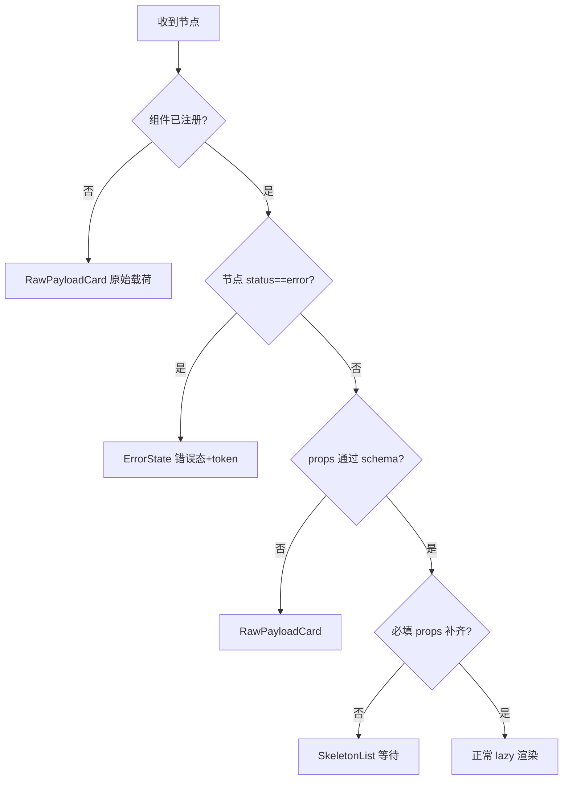
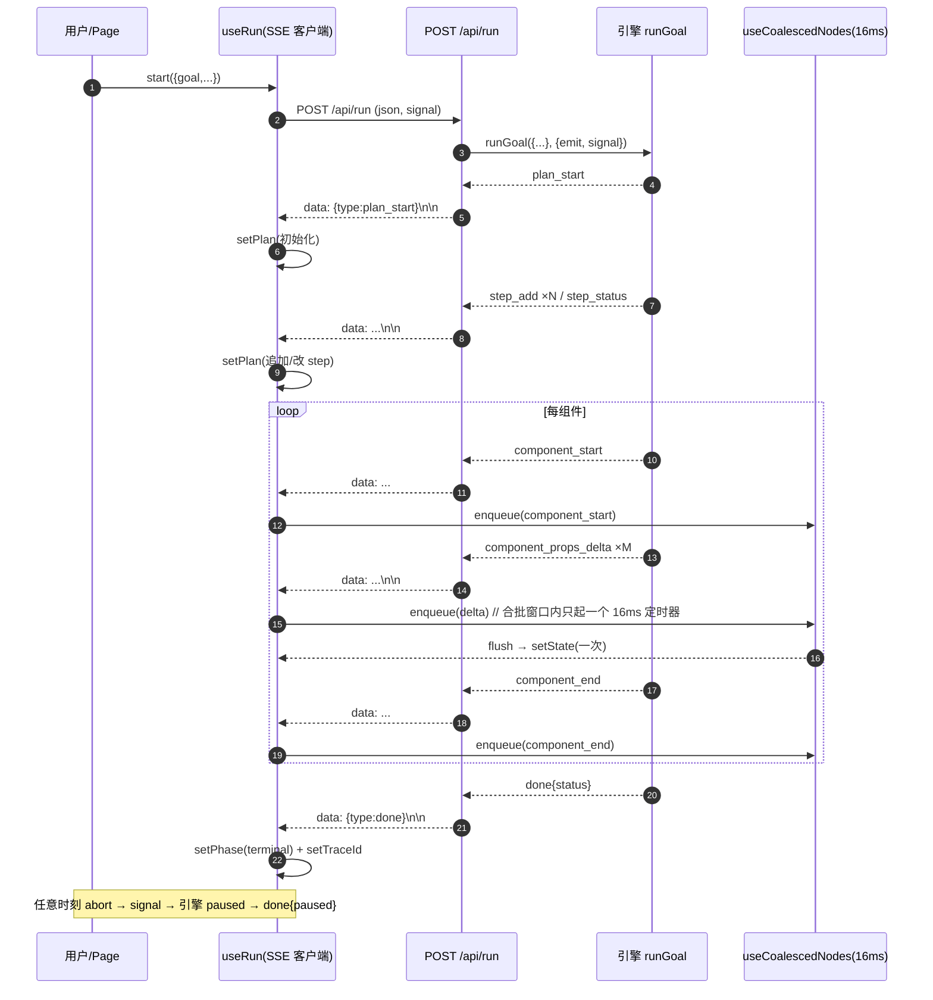

# 05 · 流式协议与前端渲染

> 对应 commit `dc9248c`（tag `m1-core-only`）
> 读者定位：9 年经验前端工程师（React 熟练）。本文聚焦「前端怎么消费」流式数据，契约字段的完整字段表在 `02-CONSTRAINTS.md`，面试话术在 `07`。

本篇把流式链路拆成三段：**服务端怎么发**（SSE + JSON Patch）→ **前端怎么累积**（nodeReducer 折叠成节点树）→ **怎么合批与降级**（useCoalescedNodes + ComponentRenderer）。读完应能回答：为什么不用 `ai/rsc`、坏帧怎么不白屏、高频 delta 怎么不卡死、abort 怎么传导到服务端。

---

## 1. 为什么不用 `ai/rsc` 与 `streamUI`

Vercel AI SDK 的 `streamUI` / `ai/rsc` 走 React Server Component 流式序列化，**官方标注为 experimental**，生产稳定性与边界都不保证。本项目在 `CONSTRAINTS` 中明确禁掉它，代价与替代如下：

| 维度 | `ai/rsc` / `streamUI` | 本项目方案 |
| --- | --- | --- |
| 渲染边界 | RSC 直传组件树，客户端无法精细控制合批 | SSE 只传**事件**，组件渲染完全由客户端掌控 |
| 中断 | 依赖 RSC 取消，传导链路长 | `AbortController` → `request.signal` → 引擎每 batch 检查一次（`engine.ts:568`） |
| 降级 | 失败即抛，需自己兜底 | 三级降级组件内聚在 `ComponentRenderer`，绝不白屏 |
| 服务端约束 | 必须 RSC 运行时 | 全部 `'use client'`，禁 Server Actions，服务端只留一个 SSE 出口 |

**代价**：我们放弃"服务端直接吐组件"的便利，自己实现了事件协议、节点 reducer、合批层和降级链。收益是协议可观测、可测试、可降级——这正是规划型 Agent 最需要的确定性。

---

## 2. 传输层

### 2.1 请求

唯一入口 `app/api/run/route.ts`，`POST /api/run`，`Content-Type: application/json`。请求体经 `zRunRequest.safeParse`，失败返回 `400 BAD_REQUEST`（只回前 5 条 issue）。字段与 `src/features/run/useRun.ts` 的 `start()` 发送体一一对应：

```ts
// useRun.ts:164 实际发送体
body: JSON.stringify({
  goal: input.goal,
  domainId: input.domainId,
  simulate: input.simulate ?? 'none',
  replanMode: input.replanMode ?? 'diverge',
  requireConstraints: input.requireConstraints ?? false,
  answers: input.answers ?? {},
  plan: input.plan ?? null,     // 续跑快照
  edit: input.edit ?? null,     // 编辑命令
}),
```

### 2.2 响应：SSE 帧格式

响应头固定：

```
Content-Type: text/event-stream; charset=utf-8
Cache-Control: no-cache, no-transform
Connection: keep-alive
X-Accel-Buffering: no   // 关掉反代缓冲，避免被 nginx 攒批
```

每帧就是一行 `data:`（`route.ts:43`），**没有用 SSE 的 `event:`/`id:` 字段**，类型靠 JSON 里的 `type` 字段区分（discriminatedUnion）：

```ts
controller.enqueue(encoder.encode(`data: ${JSON.stringify(event)}\n\n`));
```

### 2.3 中断如何传导到服务端

前端 `abort()` 调用 `controllerRef.current?.abort()`（`useRun.ts:215`），`fetch` 的 `signal` 随之触发，底层 TCP 断开。服务端 `ReadableStream` 的 `controller` 写入会抛错，被 `route.ts:44` 的 `try/catch` 捕获并标记 `closed = true`，静默停止写入。

同时引擎在**每个执行 batch 开头**检查 `deps.signal?.aborted`（`engine.ts:568`）：

```ts
if (deps.signal?.aborted) {
  plan = { ...plan, status: 'paused' };
  deps.emit({ type: 'plan_status', planId: plan.id, status: 'paused', revision: plan.revision });
  return finish('paused', plan, 'USER_ABORTED');
}
```

即：abort → 计划置 `paused` + 下发 `plan_status` → `done{status:'paused'}`。前端 `useRun` 收到 `done` 把 `phase` 置为 `paused`（属 `RunTerminalStatus`）。注意前端也有一条并行路径：若 `fetch` 抛 `AbortError`，`useRun.ts:204` 会把 `phase` 置为 `aborted`——两条路径最终都进入可编辑终态。

---

## 3. 事件协议（9 类）

契约唯一真源 `shared/stream/events.ts`，`zStreamEvent` 是 discriminatedUnion。以下字段名、类型均与源码一致。

| # | type | 关键字段 | 前端消费 |
| --- | --- | --- | --- |
| 1 | `plan_start` | `planId, runId, goalId, domainId, revision, status, summary` | `useRun` 初始化 `plan`（`steps:[]`） |
| 2 | `plan_status` | `planId, status, revision` | `setPlan` 改 `status/revision` |
| 3 | `step_add` | `planId, step(zStep)` | `plan.steps` 追加/替换该 step |
| 4 | `step_status` | `planId, stepId, status, attempt?, reason?` | 改对应 step 的 `status/attempt` |
| 5 | `component_start` | `nodeId, component, stepId?, traceId?` | `enqueue` → reducer 建节点 |
| 6 | `component_props_delta` | `nodeId, patch: JsonPatchOperation[]` | `enqueue` → reducer 应用 JSON Patch |
| 7 | `component_end` | `nodeId, status: 'ready'\|'degraded'\|'error'` | `enqueue` → reducer 置节点终态 |
| 8 | `error` | `traceId?, message, recoverable` | `setMessage`，但**不**改 phase（终态靠 `done`） |
| 9 | `done` | `traceId, status: RunTerminalStatus, planId?, revision?, reason?` | `setPhase` + `setTraceId` + 可选 `reason` |

**纪律（源码注释）**：列表追加必须用 `{"op":"add","path":"/items/-"}`，**禁止整包重发 props**（红线 7）；前端每帧必须 `zStreamEvent.safeParse`，坏帧 `continue` 丢弃（`useRun.ts:196`），计数不中断，绝不白屏。

`JsonPatchOperation` 仅支持子集：`op ∈ {add, replace, remove}`，`path` 为 RFC 6902 指针。

---

## 4. ★ 前端状态累积：nodeReducer

plan / step 类事件由 `useRun` 直接 `setPlan`（低频，无需合批）。**组件类三个事件走 `nodeReducer`**，因为它要高频折叠 `props` 增量。

`ComponentNode` 形状：

```ts
interface ComponentNode {
  nodeId: string; component: string; stepId?: string; traceId?: string;
  status: 'streaming' | 'ready' | 'degraded' | 'error';
  props: Record<string, unknown>;
}
// NodeState = { order: string[]; nodes: Record<string, ComponentNode> }
```

核心是两个纯函数：`applyPatch`（对 props 应用一条 JSON Patch）与 `applyNodeEvent`（把事件折进节点树）。`applyNodeEvent` 是不可变更新：

```ts
// nodeReducer.ts:124
case 'component_props_delta': {
  const current = state.nodes[event.nodeId];
  if (!current) return state;
  const props = event.patch.reduce(applyPatch, current.props); // 多条 patch 顺序折叠
  return { order: state.order, nodes: { ...state.nodes, [event.nodeId]: { ...current, props } } };
}
```

`applyPatch` 的关键能力：**下钻时若中间节点缺失，按下一个 path 段自动补 `[]` 或 `{}`**（`descend`），且 `path` 末段为 `-` 时向数组 `push`（即 `/items/-` 追加语义）。整个 props 更新走 `deepClone` 保证不可变，React 才能正确 diff。

**事件 → 状态变更对照表**

| 事件 | reducer 行为 |
| --- | --- |
| `component_start` | `order.push(nodeId)`；新建节点 `status:'streaming'`，`props:{}`；已存在则**幂等忽略** |
| `component_props_delta` | `applyPatch` 逐个折叠到 `props`（不可变） |
| `component_end` | 置节点 `status`（ready/degraded/error） |
| 其他事件 | `default: return state`（不碰节点树） |

`toNodeList(state)` 按 `order` 顺序化输出供渲染（`nodeReducer.ts:155`）。

---

## 5. ★ 合批与渲染性能：useCoalescedNodes（16ms）

### 5.1 为什么是 16ms

`stepStatus` / `planStatus` 低频，但 `component_props_delta` 在 MockRuntime 里**每个字段隔 `DEFAULT_COMPONENT_DELAY_MS` 发一帧**（`engine.ts:175`）。若每帧都 `setState`，一次组件渲染会触发十几次 React 重渲染——高频 delta 的重渲染风暴会卡顿、掉帧。

`useCoalescedNodes(16)` 的做法（源码默认 `flushMs = 16`，`useRun.ts:62` 传 `16`）：

```ts
// useCoalescedNodes.ts:34
const enqueue = (event: StreamEvent) => {
  pending.current.push(event);
  if (timer.current === null) timer.current = setTimeout(flush, flushMs); // 仅首帧起一个 16ms 定时器
};
const flush = () => {
  timer.current = null;
  const events = pending.current; pending.current = [];
  if (events.length === 0) return;
  setState((prev) => events.reduce(applyNodeEvent, prev)); // 一批事件一次性折叠
};
```

即：**把 16ms 窗口内的所有 delta 攒成一个批，一次性 `setState`**。16ms ≈ 一帧（60fps）预算，既把重渲染次数压到每帧最多一次，又不让用户感知到延迟。这是经典「时间窗口合批」，与生产里的 debounce/throttle 同思路，但目标是帧对齐而非防抖。

### 5.2 与 React 19 批处理的关系

React 19 自动把同一 tick 内的多个 `setState` 合并成一次渲染。本合批层在 React 之外**先**把事件折叠成单个不可变 `NodeState`，再只调一次 `setState`——等于把"N 个 patch"压成"1 次状态更新 + 1 次渲染"。两层叠加：即使 reducer 内部多次 `setState`，React 也只渲染一次；而我们用单 `setState` 进一步减少 reducer 自身触发次数。

### 5.3 可选优化（诚实列点，当前未实现）

- **`useSyncExternalStore`**：把节点树放进外部 store，`flush` 只通知订阅，避免 `useState` 闭包与 `pending.current` 的 ref/unstate 割裂。
- **虚拟列表**：步骤/组件节点很多时只对可视区 `ComponentRenderer`，长 plan 不卡。
- **按 nodeId 分桶合批**：当前所有节点共用一个 16ms 定时器，大 plan 可改为每节点独立窗口。

---

## 6. ★ 生成式 UI：ComponentRenderer 决策链

`ComponentRenderer`（`ComponentRenderer.tsx`）是生成式 UI 唯一渲染入口，决策链即「zod 校验 → 失败降级 → 查注册表 → lazy 加载」。注意 hooks（`useMemo`）必须在任何提前 return 之前调用，所以 `LazyComponent` 先算好：

```ts
// ComponentRenderer.tsx:39
const definition = resolveComponent(domainId, node.component); // 先领域后内核
const parsed = definition?.schema.safeParse(node.props ?? {});
const LazyComponent = useMemo(() => (definition?.load ? lazy(definition.load) : null), [definition]);
const decision = decideDegrade({ componentKnown: ..., parseOk: parsed?.success, propsComplete: ..., hasError: node.status==='error', needsClarify: false, chain });
```

`decideDegrade`（`policy.ts:49`）顺序即优先级：



**流程图节点解释**：`componentKnown=false` → raw；`hasError` → error；`parseOk=false` → raw；`propsComplete=false`（流式未完）→ skeleton；否则正常渲染。

**为什么组件要 lazy**：注册表里 `load: () => import('./PlanView')`（`coreComponents.ts`），只有走到"正常渲染"分支才 `lazy(definition.load)` + `<Suspense fallback={<SkeletonList .../>}>`。好处：① 首屏不加载未用到的领域组件，包体按需；② 即便某领域组件模块加载失败，Suspense 错误边界可接住，不影响其它节点；③ 与"降级组件（RawPayloadCard/ClarifyOptions/ErrorState）`lazy:false`"形成对比——兜底组件是同步注册、随时可用，绝不在降级路径上再触发网络加载。

---

## 7. 三个兜底组件

降级链 `CORE_DEGRADE_CHAIN`（`domain/types.ts:333`）：`rawPayload:'RawPayloadCard', clarify:'ClarifyOptions', error:'ErrorState', skeleton:'SkeletonList'`。**任何分支都必须落到这四个之一，绝不白屏。**

| 组件 | 何时出现 | 长什么样 | 为什么必须有 |
| --- | --- | --- | --- |
| `RawPayloadCard`（一级） | 组件未注册 / props 没过 schema | 标题 + 原始 `props` JSON + traceId | 至少让用户**看到数据**，而不是空白 |
| `ClarifyOptions`（二级） | `needsClarify`（当前 `ComponentRenderer` 恒传 `false`，由引擎经 `emitComponent('ClarifyOptions')` 主动下发，如 `engine.ts:487` 校验不过转人工） | 问题 + 可点选项（`onAction` 回传） | 置信度不足时把决策权交还用户 |
| `ErrorState`（三级） | 节点 `status==='error'` | 错误标题 + message + traceId + recoverable | 彻底失败也要可观测、可溯源 |
| `SkeletonList`（等待期） | props 未补齐（流式进行中） | 占位骨架 | 流式未完不应报错，只占位 |

`RawPayloadCard` 与 `ErrorState` 在 `coreComponents.ts` 注册时 `lazy:false` 且 `requiredProps:[]`，即**零依赖、必可用**，保证降级链最末端不会因"组件本身加载不出来"而再崩一次。

---

## 8. 中断与恢复

链路：

1. 用户点「中断」→ `useRun.abort()` → `controller.abort()`。
2. 服务端 `route.ts` 写入抛错静默停发；引擎 batch 头检测到 `signal.aborted` → `plan_status{paused}` + `done{status:'paused'}`（`engine.ts:568`）。
3. 前端 `phase` 进入 `paused`（属 `EDITABLE_PHASES`，`page.tsx:34`）。
4. 用户可编辑某步（改标题 / 重试 / 跳过）或直接「原样继续」。`resume(edit)`（`page.tsx:54`）把 `plan` 快照 + `edit` 命令一起 `start()` 回传。
5. 服务端 `zRunRequest` 收到 `plan`/`edit`，引擎重新校验并归一状态（`resumePlan`/`edit` 在 `route.ts:58` 注入）。**这条「带答案重发」模式与澄清续跑完全复用**——`onAction`（`page.tsx:98`）收到 `select_option` 后也是 `start({...answers: next})` 原路重发。

关键点：**编辑只在终态生效**（`edit` 仅在 `paused/failed/awaiting_user/aborted` 被用来重新规划），且客户端回传的 `plan` 不可信，引擎会重校验（`zRunRequest` 注释）。这样中断不是丢失进度，而是「暂停 → 改 → 续跑」。

---

## 9. 时序图：一次完整 run



---

## 10. 已知限制与后续优化点

诚实列出（非路线图承诺）：

- **合批层用 `useState` + `setTimeout`**：`pending.current` 是 ref、`state` 是 state，二者割裂，极端情况下首个事件与 flush 的竞态需靠"先 push 再起定时器"规避；更稳的做法是 `useSyncExternalStore`（见 5.3）。
- **所有节点共用一个 16ms 窗口**：大 plan 下后续节点被迫等首节点那批 flush；可改为按 `nodeId` 分桶。
- **`needsClarify` 在 `ComponentRenderer` 恒为 `false`**：组件级置信度降级目前未真正接入，澄清均由引擎经 `emitComponent('ClarifyOptions')` 主动下发。组件自判降级路径尚未打通。
- **SSE 无重连/断点续传**：中断后只能整轮重发（靠 `paused` + 续跑模式兜底），没有原生 resumable 流。
- **`X-Accel-Buffering: no` 是约定非标准**：依赖反代遵守；若有 CDN 不识别该头，可能仍被缓冲。
- **props 更新走 `deepClone`**：大 props（如长列表）每批全量深拷贝有开销；可按 path 做结构共享优化。
- **无背压（backpressure）控制**：服务端 `emit` 不感知客户端消费速度，极端情况下 `ReadableStream` 内部缓冲可涨；目前靠 16ms 合批缓解渲染侧，传输侧未限流。
